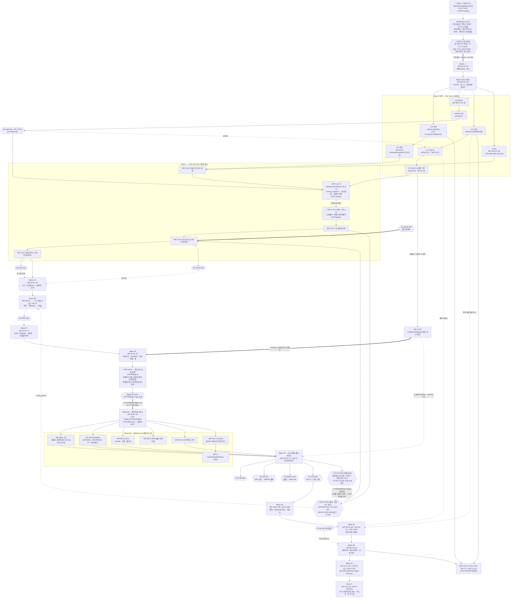

# 01. 의존성 DAG 및 병렬화

이 문서는 OpenArm v2.0 실행계획의 **척추**다 — 전체 작업패키지(WP)를 노드로, 계약·코드·값·물리 의존을 간선으로 놓은 DAG를 정의하고, 그 DAG를 **동시 fan-out 배치 + 하드 배리어**로 절단해 각 웨이브의 목표·동시성 증명·퇴장 게이트·계약 동결 지점을 못 박는다.

---

## 1. 이 문서의 경계

| 이 문서가 소유하는 것 | 이 문서가 소유하지 않는 것 (소유 문서) |
|---|---|
| WP **간선**(의존)과 간선 종류, 웨이브 배치, 동시성 증명 | **WP 노드 집합의 정본 = `02a`/`02b`/`02c`.** WP 내부 명세 {입력·산출·인터페이스계약·수용게이트·실행클래스·워크플로우 형상}도 그쪽 |
| **배리어** 위치와 사유 | 게이트 판정 규격·측정 절차·음성분기 상세 → `03-측정-게이트.md` |
| **계약 레지스트리**와 동결/해동 규칙(`CR-1`~`CR-6`) | 리스크 등록부(`R-nn`) · `PG-SAFE-001` 단계별 Human 절차 → `04-리스크-및-안전-브링업-게이트.md` |
| GUI 교차스트림 WP의 **배치 규칙**(식) | GUI WP **카탈로그** → `02d-작업패키지-GUI.md` · 워크플로우 형상 정의(`SHAPE-*`) → `05-워크플로우-오케스트레이션.md` |
| 웨이브 **퇴장 게이트** 목록 | 게이트 ID 정의 자체(불변) → SPINE §3 · 기계판독 추적성 매핑 → `06-추적성-레지스트리.md` |

> 🔴 **WP ID의 정본은 이 문서가 아니다.** `02a`/`02b`/`02c`가 WP 노드를 정의하고, 이 문서는 그 노드 위에 간선과 배치를 얹는다. 이 문서에 있고 `02*`에 없는 WP ID는 **오류**이며, 반대도 마찬가지다 — `06-추적성-레지스트리.md`의 CI가 양방향 누락을 검증한다.

표기 규약은 명세를 계승한다: `FR-<영역>-nnn` / `NFR-<영역>-nnn`, 우선순위 `M`/`S`/`C`, 상태 태그 `[확정]`/`[미확인]`/`[결정필요]`/`[신규구현]`.

> 🔴 **`M-8`을 게이트로 쓰지 않는다.** 명세에서 이 ID는 두 뜻으로 충돌한다 — `16-미해결-이슈.md` §8 = "Quest 추적 정확도, 무조사 종결", `15-비기능-요구사항.md` §2.10/§5 = "제어루프 사이클타임, 최우선 측정". 제어루프 측정은 이 계획 전체에서 **`PG-RT-001` 축(명세 매핑 `NFR-PRF-054`)** 으로만 지칭하며, 그 축은 **`PG-RT-001a`(Wave 1, 잠정) / `PG-RT-001b`(Wave 3C, 최종 정본)** 두 게이트로 쪼개져 있다(§2.5a). 🔴 **게이트 표의 ID 칸과 WP의 게이트 필드에는 `a` 또는 `b`를 쓴다 — 맨 `PG-RT-001`은 그 칸에서 금지다**(`06` CI-11b). 이 문단과 §2.5a는 경고·정의 맥락이므로 ID 인용이 허용된다.

---

## 2. 웨이브는 시간이 아니다

### 2.1 정의

**웨이브 = ① 동시 fan-out 배치 + ② 하드 배리어.** 두 성분 모두 구조이지 기간이 아니다.

| 성분 | 정의 | 판정 방법 |
|---|---|---|
| **① 동시 fan-out 배치** | 같은 스폰 시점에 병렬 워크플로우로 던져도 **서로의 산출물을 오염시키지 않음이 증명된** WP 집합 | §5 동시성 증명표. 공유 파일 0 · 공유 미동결 계약 0 · 공유 배타자원 0 |
| **② 하드 배리어** | 배치의 **전 WP가 퇴장 게이트를 통과하기 전에는 다음 배치를 스폰하지 않는다** | §4 웨이브별 퇴장 게이트 열 |

### 2.2 왜 "시간"이 아니라 "배치+배리어"인가

구현자는 사람이 아니라 Claude dynamic workflow 병렬 fan-out이다. 이 실행 모델에서 병목은 동시 실행 개수가 아니라 **계약 안정성**이다.

| 오독 모델 | 이 계획의 모델 |
|---|---|
| 웨이브 = 기간. 앞 웨이브가 "늦으면" 뒤가 밀린다 | 웨이브 = 위상 절단. 앞 배치의 게이트가 `FAIL_BLOCKING`이면 뒤는 **밀리는 게 아니라 존재하지 않는다** |
| 웨이브 안에서 서로 조율하며 진행 | 웨이브 안에서 **조율이 없다**. 조율이 필요하면 그건 같은 웨이브가 아니다 — 배리어를 넣거나 단일 소유자 WP로 합친다 |
| 앞선 워크플로우가 뒤에 알려준다 | 배치 스폰 시점의 계약이 **전부**다. fan-out된 워크플로우끼리 서로를 관측하지 못한다 |
| 늦은 발견을 리팩터링으로 흡수 | 늦은 발견 = 계약 변경 = **새 웨이브**(§6.3 `CR-3`). 흡수 경로 없음 |

**웨이브 번호는 전순서(total order)가 아니라 부분순서의 위상 절단이다.** `0-A`/`0-B`/`0-C`/`0-Ops`는 같은 대역이며 서로 앞뒤가 없다. `2A→2B→2C→2D`는 대역 내부에 배리어가 있는 사슬이다.

### 2.3 대가 — 이것은 무엇을 나쁘게 만드는가

| 선택 | 나빠지는 것 | 그럼에도 받는 이유 |
|---|---|---|
| **하드 배리어** | **총 처리량을 나쁘게 만든다.** 배치에서 가장 느린 WP 하나가 배치 전체를 붙잡는다. 게이트를 기다리는 fan-out 슬롯은 전부 유휴다 | 배리어 없이 계약이 흐르면, 오염이 **하류 아티팩트 전체를 조용히 무효화**한다. 유휴 슬롯은 회수 가능하고 오염된 데이터셋·체크포인트·마찰 모델은 회수 불가능하다 |
| **계약 선동결(§6)** | **초기 설계 자유도를 나쁘게 만든다.** 측정 전에 인터페이스 모양을 정하므로, 측정 후 그 모양이 틀렸다고 판명될 수 있다 | 병렬 fan-out은 계약 없이는 존재할 수 없다. 대신 **수치는 동결하지 않는다**(SPINE §2 불변식 6, `CR-6`) — 모양만 동결하고 값은 게이트가 정한다 |
| **순차 단일소유(§5.2)** | **그 사슬의 병렬화를 0으로 만든다.** `OaOpenArmFollower`처럼 뜨거운 파일은 `WP-1-02` → `WP-1-03` 인계로 직렬화된다 | 같은 클래스를 두 워크플로우가 **동시에** 확장하면 머지가 아니라 **의미 충돌**이 난다. 머지 도구는 `connect()` 오버라이드와 `send_action()` 오버라이드가 같은 불변식을 공유한다는 걸 모른다 |
| **드라이런을 0-C로 앞당김(§4.5·§4.8)** | **Wave 0-C의 폭을 넓히고 0-대역 퇴장을 무겁게 만든다.** MuJoCo 자산·모드계층이 0-대역 퇴장 조건에 들어온다 | 드라이런은 편의가 아니라 **안전 기능**이며 수동/텔레옵의 **선행**이다. 실기 궤적 송신을 여는 웨이브(2D)보다 뒤에 있으면 선행이 아니다 |

### 2.4 배리어의 4종

| 종류 | 무엇이 막는가 | 이 계획의 실례 |
|---|---|---|
| 🔴 **집행체 배리어** | **나머지 세 배리어를 집행할 기계가 없으면 그것들은 산문이다** | **Wave −2 `BOOT` 퇴장**(§4.0a) — 레지스트리·CI 검사기 실물·상태저장소/취소·계약 동결 잠금. **전 DAG에서 단 하나뿐이며 최상류다** |
| **계약 배리어** | 소비자가 도는 동안 계약이 바뀌면 안 된다 | Wave 0-A 퇴장(액션 스키마·플러그인 API·소유자 레지스트리·단위 태그 동결), **`B-3A.0a`**(`CTR-PRIM@v1` 원시타입 선행 동결 — `WP-3A-01`~`05`를 막는다, §4.9), Wave 3A 퇴장(WS·카메라·capture·텔레오퍼레이터·recorder 계약 동결) |
| **물리 배리어** | 사람·하드웨어가 안전 상태에 있어야 한다 | `PG-SAFE-001` — 전 토크-ON 후손을 차단. `WP-1-05` 진입 조건 |
| **자원 배타 배리어** | 두 워크플로우가 같은 배타 자원을 못 잡는다 | Wave 0-Env(`pyproject.toml`/락파일 — worktree로 분리 불가), CAN `flock`(`FR-CON-010`, 단일 백엔드 프로세스), 물리 리그 1대, Quest 1대 |

### 2.5 게이트 상태 변화 시 웨이브 되감기

게이트 상태머신은 전 게이트 공통이다: `PASS` / `RETRY_WITH_VARIANT` / `DEGRADED_ACCEPTED` / `FAIL_BLOCKING` / `SUPERSEDED`.

| 상태 | DAG에 대한 효과 |
|---|---|
| `PASS` | 후손 배치 스폰 허가 |
| `RETRY_WITH_VARIANT` | **같은 웨이브 재스폰**. 후손 스폰 금지. 변이 파라미터는 게이트의 분기표(SPINE §3)가 정의. **재시도는 별도 WP ID를 낳지 않는다** — 상태머신이 표현한다 |
| `DEGRADED_ACCEPTED` | 후손 스폰 허가하되 **축소된 계약 버전**으로. 축소 사실이 계약 버전에 박힌다(예: RGB-only 프로파일, 미지원 타깃 표시) |
| `FAIL_BLOCKING` | 후손 배치 **소멸**. 후손 아티팩트 자동 stale + 미통합 작업 취소 + **명명된 대체 WP 생성** |
| `SUPERSEDED` | 계약이 새 버전으로 대체됨 → **새 웨이브를 연다**(`CR-3`). 구 버전 소비 아티팩트 전부 stale |

> 어떤 상태 변화도 "리스크 등록부에 한 줄 적고 넘어가기"로 끝나지 않는다. 상태 변화는 **DAG 변경**이며, 후손 stale 표시가 자동으로 발생하지 않으면 그 게이트는 구현이 덜 된 것이다.

### 2.5a 🔴 Wave 1 ↔ Wave 3C 순환 해소 — `PG-RT-001` 분할

**이 DAG에는 한때 순환이 있었다.** 맨 `PG-RT-001`이 Wave 1의 퇴장 게이트였는데, 그 게이트의 정본 조건(`15` §2.10 조건 4 = 실카메라 5스트림 + 무손실 PNG + 데이터셋 쓰기 + GUI 전송 **동시**)은 카메라 파이프라인과 recorder가 실기에 붙는 **Wave 3C 이전에는 성립할 수 없다.** 그리고 3C는 Wave 1 퇴장의 후손이다. → **Wave 1 ⟶ 3C ⟶ Wave 1.** 영구 정지다.

**수리 = 게이트를 쪼갠다. 새 FSM 상태를 만들지 않는다.**

| 게이트 | 웨이브 | 기준 하네스 | 지위 |
|---|---|---|---|
| **`PG-RT-001a`** | **1** (퇴장 게이트) | **합성 GIL 부하 하네스**(`WP-0C-06`) — 조건 4의 **부하 대역**을 하드웨어 없이 재현 | **잠정.** Wave 1 퇴장을 허가한다 |
| **`PG-RT-001b`** | **3C** (퇴장 게이트) | **실카메라 5스트림 + PNG + 데이터셋 + GUI 동일 프로세스** = `15` §2.10 조건 4 | **최종 정본.** `a`의 PASS를 `SUPERSEDED`로 무효화할 수 있다 |

**왜 이것으로 순환이 풀리는가 — 그리고 왜 DAG는 여전히 비순환인가.**

| 간선 | 방향 | 순서를 만드는가 |
|---|---|---|
| `WP-1-04` → `PG-RT-001a` → Wave 1 퇴장 → … → 3C | 전방 | ✅ 만든다 |
| `WP-3C-*` → `PG-RT-001b` → 3C 퇴장 | 전방 | ✅ 만든다 |
| **`PG-RT-001b` ⇢ `PG-RT-001a`(무효화)** | **역방향** | ❌ **만들지 않는다** |

세 번째 간선이 핵심이다. `b`가 `a`를 뒤집는 것은 **착수 선행 관계가 아니라 `SUPERSEDED` 전파**다 — `a`는 `b`를 기다리지 않고 이미 PASS했고, `b`는 나중에 `a` 기반 산출(`f_max_python`, 마찰 로깅 대역, GMO 임계)을 **stale 표시**할 뿐이다(§2.5 `SUPERSEDED` 행, `06` CI-11c의 `stale_on: PG-RT-001b:PASS`). **무효화 간선은 시간을 거슬러 스폰을 막지 못하고, 스폰을 막지 못하는 간선은 위상 정렬에 참여하지 않는다.** 따라서 착수 선행 간선만으로 구성한 DAG는 **비순환**이고, 무효화는 그 위에 얹힌 **되감기 연산**이다(§2.5).

> 🔴 **맨 `PG-RT-001`은 게이트 ID 칸에서 금지다**(`06` CI-11b). 게이트 표의 ID 칸 · WP의 게이트 필드 · 측정/하네스 식별자에는 **반드시 `PG-RT-001a` 또는 `PG-RT-001b`**를 쓴다. 산문에서 "분할 이전의 게이트"를 지칭하는 이 문단 같은 서술 맥락은 예외다 — §1의 `M-8` 규약과 같은 구조다.
> **잠정을 최종이라 부르지 않는 것이 이 분할의 요점이다.** 합성 부하는 실부하가 아니다. `a`를 `PG-RT-001`이라 적는 순간 합성 하네스 위에서 낸 수치가 릴리스 합격 기준인 척 살아남는다.

---

## 3. WP ID 규약 및 노드 집합

### 3.1 형식 (정본 = `02a`/`02b`/`02c`)

**`WP-<대역>-<2자리>`.** 영역코드 없음. 예: `WP-0B-04`, `WP-3B-10`, `WP-OPS-02`.

예외 2건은 `02c`가 소유한다: `WP-4A-G1`, `WP-4C-G1`(대역 내 GUI 창구).
GUI 교차스트림 네임스페이스는 `WP-G-*` (`WP-G-00`~`04`, `WP-G-S01`~`S13`) — **카탈로그 소유자 = `02d-작업패키지-GUI.md`**, 배치 규칙만 §7이 소유한다.

### 3.2 대역별 노드 수 (기계 추출)

| 대역 | WP ID 범위 | 개수 | 카탈로그 |
|---|---|---|---|
| **Wave −2 `BOOT` 실행 부트스트랩** | `WP-BOOT-01`~`05` | **5** | `02a` (§4.0a — 전 대역의 최상류) |
| Wave −1 명세 정규화 | `WP-N1-01`~`04` | 4 | `02a` |
| Wave 0-Env | `WP-ENV-01`~`04` | 4 | `02a` |
| Wave 0-A 척추 | `WP-0A-01`~`04` | **4** | `02a` (`WP-0A-04` = B-7 복원분) |
| Wave 0-B AI-on-HW | `WP-0B-01`~`08` | 8 | `02a` |
| Wave 0-C AI-offline | `WP-0C-01`~`09` | **9** | `02a` (`WP-0C-09` = B-2 분할분) |
| Wave 0-Ops | `WP-OPS-01`~`06` | **6** | `02a` (`WP-OPS-06` = B-6 신설분) |
| Wave 1 순차 서브-DAG | `WP-1-01`~`06` | 6 | `02a` |
| Wave 2A | `WP-2A-00`~`09` | **10** | `02b` (`WP-2A-00` = B-2 잔존 인터록) |
| Wave 2B | `WP-2B-01`~`10` | 10 | `02b` |
| Wave 2C | `WP-2C-01`~`11` | **11** | `02b` |
| Wave 2D | `WP-2D-01`~`09` | **9** | `02b` |
| Wave 3A 계약동결 | `WP-3A-00`~`06` | **7** | `02b` (`WP-3A-00` = `CTR-PRIM@v1` 선행 동결분) |
| Wave 3B 구현 | `WP-3B-01`~`15` | 15 | `02b` |
| Wave 3C 통합 | `WP-3C-01`~`07` | 7 | `02b` |
| Wave 3D 데이터셋 | `WP-3D-01`~`08` | 8 | `02b` |
| Wave 4A | `WP-4A-01`~`08` + `WP-4A-G1` | 9 | `02c` |
| Wave 4B | `WP-4B-01`~`05` | 5 | `02c` |
| Wave 4C | `WP-4C-01`~`07` + `WP-4C-G1` | 8 | `02c` |
| Wave 5 | `WP-5-01`~`14` | 14 | `02c` |
| **소계 (백엔드 + `BOOT`)** | | **159** | |
| GUI 교차스트림 | `WP-G-00`~`04`, `WP-G-S01`~`S13` | 18 | **`02d`** |
| **DAG 노드 총계** | | **177** | |

> 🔴 **총계는 177이다.** 171은 `BOOT` 대역과 `WP-3A-00`이 들어오기 전의 수치이며, 이 문서가 DAG 노드 집합의 **총계 정본**이다: `171 + 1`(`WP-3A-00`, `02b` §3.5) `+ 5`(`WP-BOOT-01`~`05`, `06` §1.1) `= 177`. 수용 게이트의 정확한 진술은 **"전 WP(177 = 비-`BOOT` 172 + `BOOT` 5) 등재 + `CI-01`~`CI-17` green"**이며, `00` §3.5 · `05` §0.1 · `06` §1.1이 이 진술과 일치한다. `06`의 양방향 대조 CI(§6.4)는 이 177을 기준으로 돈다.

**159를 만든 6개 연산** (SPINE v2 §B 감사 판정 4건 + v3 §A·#10 수리 2건). 백엔드 시작점은 153이었고 **집합이 다르다**:

| 연산 | 내용 | 근거 |
|---|---|---|
| **B-1 삭제 3건** | `WP-2A-10`·`WP-2C-12`·`WP-2D-10`(Wave 2 GUI 창구) **소멸** | Wave 2에 GUI 없음(§7.3). 세 WP는 **미동결 "초안" WS 계약을 소비**해 계약 동결 불변식을 깼다 |
| **B-2 분할 1건** | `WP-2A-00`(모드계층 + 드라이런) → **구현 본체 = `WP-0C-09` 신설** / **인터록·배리어 = `WP-2A-00` 잔존**(재범위화) | 드라이런은 수동/텔레옵의 **선행**이므로 구현은 0-C(`AI-offline` + MuJoCo 자산). 그러나 **하드게이트가 서는 자리는 2D 앞**이므로 인터록 노드는 2A 대역에 남는다. 소유 분리: 6검사기·리포트 스키마 = `WP-0C-09`, 실기전송 인터록 = `WP-2A-00`(소비자) |
| **B-6 신설 1건** | **`WP-OPS-06`** — `CTR-ERR@v1`(`OA-*` 에러코드 레지스트리) 생산 WP | 전 대역이 소비하는데 생산 WP가 없어 퇴장 게이트가 공중에 떠 있었다 |
| **B-7 신설 1건** | **`WP-0A-04`** — `CTR-UNIT@v1`(deg/rad/Nm 태그 타입) 소유 WP | `02a`가 `WP-0A-02`에 플러그인 API와 액션 스키마를 합치며 단위 계약의 소유자를 증발시켰다 |
| **B-3A.0a 신설 1건** | **`WP-3A-00`** — `CTR-PRIM@v1`(공유 원시타입) 선행 동결 WP | 3A의 5개 스키마는 카메라 식별자·타임스탬프 도메인·프레임 타입·액션 페이로드 형상·큐 의미론·에러 봉투를 **공유한다**. 옛 "상호참조 0" 주장은 거짓이었다(§4.9) |
| **`BOOT` 신설 5건** | **`WP-BOOT-01`~`05`** — 레지스트리 전량 + 매니페스트/인덱스 · CI-01~18 실물 · 상태저장소/취소 · 계약 해시 동결 잠금 | 계획의 집행체가 **존재하지 않았다.** 규칙과 규칙의 실행체를 같은 것으로 취급하면 전 불변식이 산문이다(`00` §3.5) |
| **결과** | 153 − 3 + 1 + 1 + 1 + 1 + 5 = **159** | |

> 🔴 **이 표의 ID는 전부 `02a`/`02b`/`06`이 실제로 카탈로그·대역표에 실은 것이며, 이 문서가 발명한 것은 0건이다.** `WP-0C-09`(`02a` §5)·`WP-0A-04`(`02a` §3.2)·`WP-OPS-06`(`02a` §6)·`WP-2A-00`(`02b` §2)·`WP-3A-00`(`02b` §3.5 — `CTR-PRIM@v1` 소유)·`WP-BOOT-01`~`05`(`06` §1.1 — ID 발급처는 `02a`)를 직접 확인했다. 반대로 이 문서에 있고 카탈로그에 없는 ID는 오류이며, §6.4의 양방향 대조 검사가 잡는다.

### 3.3 실행 클래스·형상 약칭

실행 클래스(SPINE §4): `AI-offline` · `AI-on-HW` · `Human-assisted-HW` · `Human-judgment`.
워크플로우 형상(**정본 = `05` 5종**): `SHAPE-CF`(계약동결·단일소유) / `SHAPE-IM`(구현·픽스처 fan-out) / `SHAPE-IG`(통합 배리어) / `SHAPE-MS`(측정) / `SHAPE-HG`(Human 게이트). 5종 밖의 형상은 존재하지 않는다.

### 3.4 간선 종류 — 동시성 판정은 간선 종류로 갈린다

| 종류 | 뜻 | 배치 규칙 |
|---|---|---|
| **코드** | 소비자가 생산자의 심볼/파일을 import 하거나 편집한다 | **같은 배치 금지.** 배리어 필요 |
| **계약** | 소비자가 생산자가 동결한 스키마/시그니처를 따른다 | 계약이 **배치 스폰 전에 동결**되어 있으면 같은 배치 가능 |
| **값(늦은 바인딩)** | 소비자 코드는 독립이고, 게이트가 산출한 **수치/플래그만** 주입된다 | **같은 배치 가능.** 값은 배치 퇴장 시점에 결합. 예: `PG-J7-001` → MJCF `tMax` |
| **물리** | 리그·전원·사람 상태에 의존 | 배타 자원 배리어. 동시 불가 |

---

## 4. 웨이브 전개

### 4.0 마스터 절단표

| 웨이브 | 목표 (한 줄) | 지배 배리어 | 퇴장 게이트 |
|---|---|---|---|
| **🔴 −2 `BOOT` 실행 부트스트랩** | **계획을 실행할 기계** — 레지스트리 전량 · 매니페스트/인덱스 · CI-01~18 실물 · 상태저장소/취소 · 계약 동결 잠금 | **집행체**(전 배리어의 전제) | **전 WP(177) 등재 + `CI-01`~`CI-17` 자기 코퍼스 green.** 미달 = `FAIL_BLOCKING` → **어떤 WP도 착수 불가** |
| **−1 명세 정규화** | 모순 해소 원장 + 정규화 해시 | 계약 | 정규화 해시 발행 + CI 참조검사기 통과 (`WP-N1-04`) |
| **0-Env (단독)** | LeRobot v0.6.0 commit SHA 핀 + 락파일 + CI + 계약회귀 검사기 | 자원 배타 | 락파일 재현성 + 계약회귀 검사기 그린 |
| **0-A 척추** | `ActuationScheduler`(오프라인) + 플러그인 API·액션스키마·소유자 레지스트리·단위 태그 동결 | 계약 | `CTR-PLUG@v1`·`CTR-ACT@v1`·`CTR-OWN@v1`·`CTR-UNIT@v1` 동결 |
| **0-B (AI-on-HW)** | CAN·udev·`ip link`·flock·침입자탐지 + RID 리드 + 카메라 열거 | 자원 배타 + 물리 | `PG-RID-001` · `PG-J7-001` · `PG-VMAX-001` · `PG-CAM-001` |
| **0-C (AI-offline)** | MuJoCo 백엔드·IK 어댑터·MJCF v2 검수·FK↔IK 회귀·더미모드·GIL 부하 하네스·학습/평가통계·정책 호환 매트릭스·**모드계층+드라이런** | 계약 | FK↔IK 회귀 그린 + 정책 호환 매트릭스 발행 + **드라이런 6검사 결함주입 그린** |
| **0-Ops** | writer ACL·udev 영속·systemd CAN·버전핀·롤백·`push_to_hub=false`·구조화 로그·크래시 워치독 | 계약 | `CTR-ERR@v1` 동결 + 롤백 드릴 그린 |
| **1 (순차 서브-DAG)** | 실기 브링업. **병렬 아님** | 코드 + 물리 | **`PG-RT-001a`**(잠정, §2.5a) · `PG-CAN-001` · `PG-SAFE-001` · `PG-STOP-001` · `PG-VEL-001` |
| **2A** | 보수적 조그·데드맨(리스)·상시홀드·클램프·감사로그 | 물리 | 조그 세션 프리플라이트 그린 (정지·속도 정본은 Wave 1에서 **소비**) |
| **🔴 2A 이전 — 부트스트랩 리미터** | 모터 vMax·감속비에서 **도출한** 보수 속도 리미터가 **속도 스윕에 선행**(§4.7.3) | 값(도출) | 도출표 발행 — `PG-VEL-001`은 그 뒤 **도출값 대비 검증**이지 "한계 발견"이 아니다 |
| **2B** | v2 중력모델·페이로드·마찰동정 | 물리 | `PG-FRIC-001` |
| **2C** | GMO 잔차·임계·정지반응·가상벽·충돌 프리플라이트 | 물리 | GMO 임계 도출 또는 **비활성 유지** 확정 |
| **2D** | 카테시안·Freedrive·티칭·재생·홈 | 물리 + **드라이런 하드게이트** | Freedrive 수용 (`PG-FRIC-001` 종속) |
| **3A** | 계약 동결: **공유 원시타입 선행**(`WP-3A-00`) → 카메라 registry·capture·텔레오퍼레이터·WS 스키마·recorder·픽스처 | 계약 (**내부 배리어 `B-3A.0a`**) | `CTR-PRIM@v1` 동결 → `CTR-CAM/CAP/TEL/WS/REC@v1` 동결 |
| **3B** | 픽스처 대상 병렬 구현 (**최대 fan-out 지점**) | — | 픽스처 그린 전량 + 계약 해시 일치 |
| **3C** | 기록/프리뷰/텔레옵 통합 처리량·무결성 | 물리 | `PG-CAM-001` · `PG-STO-001` · `PG-VR-001` · **`PG-RT-001b`**(최종 정본, §2.5a) |
| **3D** | 데이터셋 편집·계보 | 계약 | 무결성 검증 전항목 통과(`NFR-DAT-005`) |
| **4A** | 학습·추론 어댑터(픽스처) | 계약 | 정책 구조 사전검증 그린(`FR-TRN-017`) |
| **4B** | 데이터셋→체크포인트→추론 호환 게이트 | 계약 | stats 해시 일치(`OA-DAT-002`) |
| **4C** | 실기 평가 (Wilson/Clopper-Pearson CI) | 물리 | CI 산출 + `FR-TRN-072` 가드 |
| **5** | GUI 13화면 완성 감사 + 하드닝·패키징·복구 드릴 + Isaac Tier-2 | — | 13화면 라우트 전수 + 복구 드릴 그린 |

---

### 4.0a 🔴 Wave −2 `BOOT` — 실행 부트스트랩 (모든 것의 최상류)

**이 DAG에는 루트가 하나뿐이다. `BOOT`이다.** 다른 모든 노드는 `BOOT`의 후손이며, **Wave −1도 예외가 아니다.**

**내부 미니 서브-DAG**: `BOOT-01` → `BOOT-02` → `BOOT-03` → `BOOT-04` → `BOOT-05` — **선언된 순서로 직렬. 동시 없음.**

> 🔴 **이 대역만은 병렬화하지 않는다 — 두 가지 독립된 이유가 같은 답을 가리킨다.**
> ① **간선이 금지한다.** `02a` §−2가 `BOOT-03`·`04`·`05`의 입력에 **전부 `BOOT-02`**(매니페스트 스키마·인덱스)를 선언한다. `02`를 소비하는 셋은 `02`와 동시일 수 없다.
> ② **폭을 계산할 근거가 아직 없다.** `SHAPE-IM`의 `n`은 **소유권 겹침 증명**을 전제하고 그 증명기는 `WP-0A-03`이 짓는데, 그것은 `BOOT`의 **하류**다. 즉 `BOOT`은 **자기 자신을 병렬화할 근거를 만들 수 없다**(`02a` §−2).
>
> **대가**: `BOOT`이 느려진다. 그러나 `BOOT`은 전부 `AI-offline`이고 **일정은 이 묶음의 통화가 아니다**(`00` §1.3) — 웨이브는 시간이 아니라 위상 절단이다. 형상 칸의 정본은 `02a`~`02d`이며 이 표는 그 **인용**이다(`00` §9.2).

| WP | 내용 | 클래스 | 형상 |
|---|---|---|---|
| `WP-BOOT-01` | **`registry/traceability.yaml` 전량**(177 WP × `{owns, consumes, produces, gate, stale_on, negative_branch}`) + JSON Schema | `AI-offline` | `SHAPE-CF` |
| `WP-BOOT-02` | **WP 매니페스트 스키마 + 인덱스 생성기**(`req_index`/`wp_index`/`glob_index`/`contract_index`/`gate_index`) | `AI-offline` | `SHAPE-CF` |
| `WP-BOOT-03` | 🔴 **CI 검사기 실물** — `CI-01`~`CI-18` 전량(`registry/check.py`) | `AI-offline` | `SHAPE-CF` |
| `WP-BOOT-04` | **워크플로우 상태 저장소 + 취소 메커니즘** — 실행클래스별 분기(`AI-offline` = 현 스텝 완주 / `AI-on-HW`·`Human-assisted-HW` = **즉시 스케줄러 latch-to-hold 후 취소**) | `AI-offline` | `SHAPE-CF` |
| `WP-BOOT-05` | **계약 해시 등재 + 동결 잠금**(`CONTRACT_FROZEN` 집행) | `AI-offline` | `SHAPE-CF` |

**직렬 근거**: `BOOT-01`(스키마 + 레지스트리 인스턴스)이 먼저 착지해야 나머지 넷이 질의·검증·잠금할 대상이 생긴다 — **코드 간선**. 그 뒤로도 직렬이 유지되는 이유는 간선이 더 있기 때문이다: `02a` §−2가 `BOOT-03`·`04`·`05`의 입력에 **전부 `BOOT-02`**(매니페스트 스키마·인덱스)를 선언한다.

> ⚠️ **배타 소유는 병렬의 필요조건이지 충분조건이 아니다.** `BOOT-02`~`05`가 서로 다른 트리를 배타 소유하는 것은 사실이다(`registry/generate/**` · `registry/checks/**` · `registry/state/**`+`ops/cancel/**` · `registry/contracts/**` — 공유 파일 0 · 공유 배타자원 0 · 물리 0). 그러나 **소유가 겹치지 않아도 간선이 있으면 직렬**이고, 여기엔 `BOOT-02` → {`03`,`04`,`05`} 간선이 실재한다. 게다가 폭 `n`을 정당화할 소유권 겹침 **증명기(`WP-0A-03`)가 `BOOT`의 하류**이므로, 이 대역은 자기 병렬화를 **증명할 수단 자체가 없다**(`02a` §−2).

**배리어 사유**: **집행체.** 다른 세 종(계약·물리·자원배타, §2.4)과 종류가 다르다 — 계약 배리어는 "계약이 동결되어 있을 것"을 요구하는데, **동결을 잠글 기계가 없으면 그 요구 자체가 집행되지 않는 문장**이다. `BOOT`은 나머지 배리어를 **실재하게 만드는** 배리어다.

**퇴장 게이트**: **전 WP(177) 레지스트리 등재 + `CI-01`~`CI-17`이 자기 코퍼스에서 green.** 미달 = **`FAIL_BLOCKING`**.

| `BOOT` 미통과 상태의 DAG 효과 | |
|---|---|
| **후손 집합** | **`WP-BOOT-*`를 제외한 172개 전부.** Wave −1(`WP-N1-01`~`04`) 포함 |
| **착수 가능 WP 수** | **0** |
| **왜 −1조차 막히는가** | Wave −1의 산출은 **정규화 해시**이고, 해시의 쓸모는 "해시 참조 없는 WP 착수를 CI가 차단한다"는 데 있다(§4.1). 그 CI는 `WP-BOOT-03`의 산출이다. 검사기 없이 발행한 해시는 **아무도 대조하지 않는 문자열**이다 |

> 🔴 **`BOOT` 이전에 스폰한 fan-out은 되돌릴 수 없다.** §2.5의 되감기(후손 stale · 미통합 작업 취소 · 대체 WP 생성)는 전부 **후손 집합을 열거할 수 있을 때만** 성립하고, 열거는 `WP-BOOT-01`의 레지스트리 + `WP-BOOT-02`의 역인덱스 위에서만 가능하다. 등재되지 않은 채 흐른 아티팩트는 **무효화 전파의 시작점을 특정할 수 없다** — 즉 오염을 발견해도 어디까지 오염됐는지 모른다. 이것이 `BOOT`을 크리티컬 패스 맨 앞에 놓는 유일한 이유이며, "지루하니 나중에"가 통하지 않는 이유다.
> **대가**: 이것은 **첫 착수를 나쁘게 만든다** — 로봇을 1 mm도 움직이지 않는 5개 WP가 177개 전부를 막는다. 그리고 부트스트랩이 틀리면 그 위에 세운 177개가 전부 틀린다. 그 위험은 D2 파일럿(`00` §3.5b — `WP-0C-02` IK 어댑터 1개를 부트스트랩 직후 끝까지)이 **표본 1개로** 줄일 뿐 없애지 못한다. 그럼에도 받는 이유: 대안은 **아무도 안 보는 규칙을 177번 위반하는 것**이다.

---

### 4.1 Wave −1 — 명세 정규화 (블로킹)

**진입 조건**: 🔴 **`BOOT` 수용 게이트 PASS**(§4.0a). 이 웨이브는 DAG의 루트가 아니다.

**목표**: 확인된 모순 6건(NORM-001~004, 006~007)을 판정하고 승리 텍스트를 확정한다. **정규화 해시 참조 없는 WP 착수 금지.**

**내부 미니 서브-DAG**: `N1-01` → `N1-02 · N1-03 (동시)` → `N1-04`.

| WP | 내용 | 클래스 | 형상 |
|---|---|---|---|
| `WP-N1-01` | 정규화 원장 스키마·판정 절차 확립 | `AI-offline` | `SHAPE-IG` |
| `WP-N1-02` | 모순 6건 판정 적재 (NORM-001~004, 006~007) | `AI-offline` | `SHAPE-IG` |
| `WP-N1-03` | 게이트 ID 네임스페이스 분리 · `M-8` 봉인 | `AI-offline` | `SHAPE-IG` |
| `WP-N1-04` | 정규화 해시 발행 · 착수 차단 게이트 | `AI-offline` | `SHAPE-IG` |

**동시성 근거**: `N1-02`(원장 6행 = `ledger/NORM-00n.md` 배타 소유)와 `N1-03`(게이트 네임스페이스 판정)은 서로 다른 원장 네임스페이스를 소유한다 — `N1-02` → `connect_contract`·`mode_contract`·`limit_contract`, `N1-03` → `gate_contract`. 공유 파일 0.
**배리어 사유**: 계약. 정규화 해시가 없으면 하류 WP가 어느 텍스트를 구현하는지 특정할 수 없고, `06`의 `요구사항 → WP` 매핑이 성립하지 않는다.
**퇴장 게이트**: 정규화 해시 발행 + CI가 "해시 참조 없는 WP 착수"를 차단함을 실증.

> ⚠️ `WP-N1-02`는 U-1(바이래터럴 OUT)과 함께 `01` §4.2 **(T-BI) 전이의 존재 근거를 소멸**시킨다. 명세 자체가 "이 전이가 존재하는 것 자체가 아키텍처 부채"라고 적었고, U-1이 그 부채를 청산한다. 원장은 (T-BI)·`NFR-SYS-003`·`BILATERAL` 모드를 **폐기 텍스트**로 명시해야 한다 — 그러지 않으면 Wave 1이 "버스를 놓는 전이"를 구현하려 든다.

---

### 4.2 Wave 0-Env — 단독 배리어

**내부 미니 서브-DAG**: `ENV-01` → `ENV-02 · ENV-03 (동시)` → `ENV-04`.

| WP | 내용 | 클래스 | 형상 |
|---|---|---|---|
| `WP-ENV-01` | LeRobot **v0.6.0 commit SHA 핀** · 유령 0.6.1 차단 | `AI-offline` | `SHAPE-IG` |
| `WP-ENV-02` | 락파일 · **이기종 플릿 환경 매트릭스**(Nano/Orin/5090/A6000) | `AI-offline` | `SHAPE-IG` |
| `WP-ENV-03` | CI 파이프라인 골격 | `AI-offline` | `SHAPE-IG` |
| `WP-ENV-04` | **계약 회귀 검사기**(상류 심볼·시그니처 핀, §6.4) | `AI-offline` | `SHAPE-IG` |

**동시 fan-out**: **대역 자체가 단독.** 0-A/0-B/0-C/0-Ops 네 배치가 이 대역을 기다린다.
**배리어 사유**: 자원 배타. 두 트랙이 `pyproject.toml`·락파일을 함께 건드리면 worktree로 격리해도 **머지 시점에 의존성 해석이 재실행**되므로 격리가 성립하지 않는다. 락파일은 텍스트 머지가 가능해도 의미 머지가 불가능하다.

> 그럼에도 받는 이유: 핀이 흔들리면 `PG-RT-001`·`PG-DEPTH-001`을 포함한 **모든 측정 게이트의 재현성이 소멸**하고, 게이트가 재현 불가능하면 게이트가 아니다.

---

### 4.3 Wave 0-A — 척추 (계약 선동결 → 구현)

**내부 미니 서브-DAG**: `0A-02 · 0A-03 · 0A-04 (동시)` → **계약 배리어** → `0A-01`.

| WP | 내용 | 클래스 | 형상 | 산출 계약 |
|---|---|---|---|---|
| `WP-0A-02` | **통합 로봇플러그인 API + 액션/관측 스키마 동결** — 실기/MuJoCo/Isaac/더미가 공유하는 단일 `Robot` ABC 표면 + SPINE §6 6채널 | `AI-offline` | `SHAPE-CF` | `CTR-PLUG@v1`, `CTR-ACT@v1` |
| `WP-0A-03` | **파일/모듈 소유자 레지스트리 동결** — `{파일, WP, 구간}` 3튜플 | `AI-offline` | `SHAPE-CF` | `CTR-OWN@v1` |
| `WP-0A-04` | **단위 태그 타입 동결** — deg / rad / Nm (B-7 복원) | `AI-offline` | `SHAPE-CF` | `CTR-UNIT@v1` |
| `WP-0A-01` | **`ActuationScheduler` 구현 (오프라인)** — 매 틱 4종 중 하나 방출 {수용 타깃 / stale-source 홀드 / 모드전환 홀드 / 안전래치 홀드}. 생산자는 타임스탬프 타깃을 **메일박스에 publish만**. 모드 전환 = 스케줄러 **정지 없이** 생산자 원자 교체 | `AI-offline` | `SHAPE-IM` | — |

> 🔴 **`WP-0A-01`은 CAN을 만지지 않는다.** Wave 0-A의 스케줄러는 **순수 로직 + 합성 클럭**이며, 실기 `OaOpenArmFollower`로의 **통합은 `WP-1-03`**이다. 이 분리가 없으면 스케줄러 구현이 Wave 1 직렬 사슬 안으로 끌려들어가 Wave 0의 fan-out이 붕괴한다.
> 🔴 **`CTR-UNIT@v1`은 `WP-0A-04`라는 자기 소유 WP를 가진다(B-7).** deg·rad·Nm 태그 타입은 SPINE §2 불변식 7(조용한 실패 방어)의 축이며, `09` `FR-SIM-082`가 요구하는 "변환 경계 단 한 곳"을 기계적으로 강제하는 유일한 장치다. `WP-0A-02`에 스키마와 함께 묻으면 **소유자 없는 계약**이 되고, 소유자 없는 계약은 계약이 아니라 관습이다 — 관습은 fan-out에서 지켜지지 않는다.

**동시성 근거**: `0A-02`(플러그인 표면 + 스키마 정의 파일) / `0A-03`(소유자 레지스트리) / `0A-04`(태그 타입 모듈) — 세 산출물은 서로 다른 파일이고 서로를 import 하지 않는다. `0A-01`은 셋을 **모두 import** 하므로 배리어 뒤.
**퇴장 게이트**: 네 계약 동결 + 스케줄러 4종 방출 분기 전수에 대한 결함주입 테스트 그린.

---

### 4.4 Wave 0-B — AI-on-HW (읽기·측정, 물리 조작 없음)

**내부 미니 서브-DAG**: `0B-01·02·03·04·05·06·08 (동시)` → **자원 배타 배리어(flock + 링크 + 24V)** → `0B-07`.

| WP | 내용 | 클래스 | 형상 | 산출 게이트 |
|---|---|---|---|---|
| `WP-0B-01` | **flock 배타 락** — SocketCAN은 배타 bind를 제공하지 않는다 | `AI-on-HW` | `SHAPE-IM` | — |
| `WP-0B-02` | **`ip link` 파싱·검증** — CAN-FD(nominal 1 Mbps / data 5 Mbps)·`ERROR-ACTIVE` | `AI-on-HW` | `SHAPE-IM` | — |
| `WP-0B-03` | **침입자 탐지** — `/proc/net/can/rcvlist_all` ifindex별 RX 리스너 수 능동검사 | `AI-on-HW` | `SHAPE-IM` | — |
| `WP-0B-04` | **이중 바인드 능동 검사** — 두 프로세스 bind 시 **둘 다 성공**(`13` F-1) | `AI-on-HW` | `SHAPE-IM` | — |
| `WP-0B-05` | **udev 고정 이름** (실물 디스크립터 — `ethtool -i`/`dev_id`) | `AI-on-HW` | `SHAPE-MS` | — |
| `WP-0B-06` | **USB 토폴로지 · RTT · HOL 실측** | `AI-on-HW` | `SHAPE-MS` | `PG-CAN-001` **증거 공급** |
| `WP-0B-08` | **카메라 열거** — 타입·모델·시리얼, USB 루트허브/컨트롤러 귀속, USB 2.0 폴백 감지 | `AI-on-HW` | `SHAPE-MS` | **`PG-CAM-001`** |
| `WP-0B-07` | **RID 리드 하네스** — RID 9(comm-loss timeout, **16모터 전량**) · RID 23(TMAX/J7 타입) · RID 22(VMAX) · RID 21(PMAX) · RID 13/14(펌웨어) · ERR 니블 | `AI-on-HW` | `SHAPE-MS` | **`PG-RID-001`** · **`PG-J7-001`**(증거) · **`PG-VMAX-001`** |

**동시성 근거**:

| 쌍 | 잠재 충돌 | 판정 |
|---|---|---|
| `0B-01` ↔ `0B-02`/`03`/`04` | vcan 인터페이스 | 각자 **자기 이름의 vcan**을 생성·파괴(`vcan_0b01_*` 등). 실물 채널은 `0B-07`만 잡는다 | ✅ |
| `0B-05` ↔ `WP-OPS-02` | udev 규칙 | **소유권 분할**: `0B-05` = 프로브(매칭되는가), `OPS-02` = 규칙 **파일**(패키징·영속·롤백). `CTR-OWN@v1`이 이 분할을 명시 | ✅ |
| `0B-06`/`0B-08` ↔ 나머지 | 없음 (USB vs CAN) | 물리적으로 분리된 서브시스템 | ✅ |
| `0B-07` ↔ 나머지 전부 | **실물 CAN 채널 배타 점유 + 24V** | ❌ **배리어 필요.** RID 리드는 링크가 FD로 올라오고 `flock`을 보유한 상태에서만 가능 |

**배리어 사유**: 자원 배타(물리 CAN 채널 1조) + 물리(24V 전원 인가 — `02` `FR-CON-009`).
**퇴장 게이트**: `PG-RID-001` · `PG-J7-001` · `PG-VMAX-001` · `PG-CAM-001`.

> 🔴 **`PG-RID-001` 읽기 실패 = 토크-ON 금지.** 이 게이트의 음성 분기는 `WP-1-05`로 가는 간선을 **끊는다**. 이종값이면 최소값 설계 또는 차단, `0`이면 HW 폴백 비활성·플래그.

---

### 4.5 Wave 0-C — AI-offline (최대 fan-out 대역)

**내부 미니 서브-DAG**: `0C-01·05·06·07·08 (동시)` → `0C-03` → `0C-02` → `0C-04 · 0C-09`.

| WP | 내용 | 클래스 | 형상 | 산출 게이트 |
|---|---|---|---|---|
| `WP-0C-01` | **MuJoCo 백엔드** (`Robot` ABC) — 1단계 정본 | `AI-offline` | `SHAPE-IM` | — |
| `WP-0C-05` | **더미 모드** — 하드웨어 없이 파이프라인 전 구간 | `AI-offline` | `SHAPE-IM` | — |
| `WP-0C-06` | **합성 GIL 부하 하네스** — `15` §2.10 조건 4의 **부하 대역**을 하드웨어 없이 재현(idle / GIL 부하 / 프로세스 분리). 🔴 **조건 4 정본은 아니다** — 실카메라·실라이터는 `PG-RT-001b`가 소유 | `AI-offline` | `SHAPE-CF` | **`PG-RT-001a`** 기준 하네스 **공급**(§2.5a) |
| `WP-0C-07` | **학습·평가 통계** — 합성 48차원 데이터셋 선행(CAN 무관). 채널별 통계·`std ≈ 0` 검출·stats 내용 해시 | `AI-offline` | `SHAPE-IM` | — |
| `WP-0C-08` | **정책 호환 매트릭스** — `FR-TRN-064` `[확정]`: 상한 32 정책(SmolVLA·pi0·pi05) → 양완 48차원 초과 → **학습 차단**. GR00T(132) 수용 | `AI-offline` | `SHAPE-IM` | — |
| `WP-0C-03` | **MJCF v2 자산 검수 + J7 `motor_DM3507` 클래스 수정** — **`tMax` 2배 오차 → 마찰동정 전체 오염** | `AI-offline` | `SHAPE-CF` | **`PG-J7-001` 판정** |
| `WP-0C-02` | **IK 어댑터** — `jnt_range` 덮어쓰기 **선행**, **무제약 폴백 차단** | `AI-offline` | `SHAPE-CF` | `PG-IK-001` **하네스 공급**(타깃별) |
| `WP-0C-04` | **FK↔IK 회귀** — `openarm_control.Kinematics.fk_bimanual()` 기준(MJCF 월드, m/rad) | `AI-offline` | `SHAPE-IM` | — |
| `WP-0C-09` | 🔴 **모드계층 + 드라이런 하드게이트** (B-2 이관: 구 `WP-2A-00`) — `SimBackend` 선택자(기본 MuJoCo 1단계), 드라이런 6검사기(위치·속도·토크·셀충돌·자가충돌·리프터), 실기전송 하드 차단 인터록, 검증 리포트 스키마 | `AI-offline` | `SHAPE-CF` | — |

**동시성 근거**:

| 쌍 | 잠재 충돌 | 판정 |
|---|---|---|
| `0C-01` ↔ `0C-05` | `Robot` ABC 표면 | `CTR-PLUG@v1` 동결됨 → 각자 별도 구현 클래스 파일 | ✅ |
| `0C-07` ↔ `0C-08` | 48차원 채널 정의 | `CTR-ACT@v1` `rawObservation`(48ch) 동결됨 | ✅ |
| `0C-03` ↔ `0C-01` | **MJCF 자산 파일** | ❌ 배리어. `0C-01`이 MJCF를 로드하고 `0C-03`이 수정한다 → 순차 |
| `0C-02` ↔ `0C-03` | **MJCF `jnt_range`** | ❌ 배리어. IK 어댑터의 `jnt_range` 덮어쓰기는 자산 검수 후에만 의미가 있다 |
| `0C-04` ↔ `0C-02` | IK 어댑터 심볼 | ❌ 배리어. **코드 간선** |
| `0C-09` ↔ `0C-01`/`0C-02`/`0C-03` | 드라이런 6검사기 ↔ MuJoCo·IK·MJCF | ❌ 배리어. 드라이런은 셋 위에 선다. **CAN은 열지 않는다**(`01` §4.1 `SIM` = CAN 락 미보유) |
| **`0C-03` ↔ `WP-0B-07`** | J7 모터 타입 | ✅ **값 간선(늦은 바인딩).** `0C-03`은 J7 클래스를 **파라미터화**해 착지하고, `PG-J7-001`이 산출한 값은 **0-대역 퇴장 배리어에서 주입**된다. 두 WP는 같은 배치에서 동시에 돈다 |

**배리어 사유**: 코드(자산 → 어댑터 → 회귀·드라이런).
**퇴장 게이트**: FK↔IK 회귀 그린 + 정책 호환 매트릭스 발행 + MJCF 자산 해시 확정 + **드라이런 6검사 결함주입 그린**(위반 궤적 6종 주입 → 실기 전송이 각각 차단됨).

> 🔴 **`PG-J7-001` 불일치 → MJCF 자산 수정이 `WP-2B-07`(마찰 식별)의 하드 선행이다.** 값 간선이 0-대역 안에서 닫히지 않으면 Wave 2B 진입 간선을 끊는다 — 오염된 `tMax` 위에서 동정한 마찰 모델은 재사용 불가능한 아티팩트다.
> 🔴 **`WP-0C-09`가 0-C에 있는 이유(B-2).** 드라이런은 `AI-offline`이고 MuJoCo 자산 위에 서며, **실기 궤적을 여는 모든 웨이브의 선행**이다. 이것을 Wave 2A 배리어나 Wave 3B에 두면 "선행"이라는 말이 거짓이 된다 — 2D가 이미 궤적을 실기에 흘린 뒤에 도착하기 때문이다. 소비 지점은 §4.8(2D 앞 하드게이트)과 §4.9(`WP-3C-05`)다.

---

### 4.6 Wave 0-Ops

| WP | 내용 | 클래스 | 형상 | 산출 계약 |
|---|---|---|---|---|
| `WP-OPS-01` | **writer ACL · systemd sandbox** — 원시 CAN 조작 게이팅 | `AI-on-HW` | `SHAPE-IM` | — |
| `WP-OPS-02` | **udev 고정 · systemd CAN 유닛** — **규칙/유닛 파일의 단일 소유자** | `AI-on-HW` | `SHAPE-IM` | — |
| `WP-OPS-03` | **버전 핀 · 롤백** | `AI-offline` | `SHAPE-IM` | — |
| `WP-OPS-04` | **`push_to_hub=false` 강제 + 로컬 바인딩** — LeRobot 기본값이 `True`이고 `finally` 블록이 호출한다 | `AI-offline` | `SHAPE-IM` | — |
| `WP-OPS-05` | **구조화 로그 · 크래시 워치독** — 프로세스 사망/bus-off = **낙하**; SW 워치독은 늦출 뿐 못 막는다 | `AI-offline` | `SHAPE-IM` | — |
| `WP-OPS-06` | **`OA-*` 에러코드 레지스트리 동결** — `OA-<도메인>-<3자리>`. **정본 = `14` §2.10** (B-6 신설) | `AI-offline` | `SHAPE-CF` | **`CTR-ERR@v1`** |

**동시성 근거**: 여섯 WP는 서로 다른 파일 트리를 소유한다(`/etc` 규칙·sandbox / 유닛 파일 / 락파일·롤백 / config 강제 주입 / 로깅·워치독 모듈 / 에러코드 레지스트리). 공유 import 0. `OPS-05`는 `OPS-06`이 동결한 코드를 **소비**하지만, `CTR-ERR@v1`이 대역 진입 전 동결되므로 C2를 만족한다.
**⚠️ `WP-OPS-02` ↔ `WP-0B-05` 소유권 분할**: `0B-05`는 udev 규칙의 **프로브**(매칭되는가·이름이 붙는가)를 소유하고, `OPS-02`는 규칙 **파일**(패키징·영속·롤백)을 소유한다. 같은 웨이브 대역에서 동시에 돌 수 있는 이유는 이 분할 때문이며, **분할이 깨지면 두 WP가 같은 `.rules` 파일을 쓴다** — `CTR-OWN@v1`이 이 분할을 명시한다.
**퇴장 게이트**: `CTR-ERR@v1` 동결 + 롤백 드릴 그린 + `push_to_hub` 기본값 재정의 실증.

> 🔴 **`CTR-ERR@v1`은 이제 생산자를 가진다 — `WP-OPS-06`**(B-6). 이 계약은 **전 대역이 소비**하는데(§6.2), 소비자만 있고 생산 WP가 없으면 퇴장 게이트가 공중에 뜬다. `OA-*` 레지스트리의 정본 텍스트는 `14` §2.10이고, `WP-OPS-06`은 그것을 **기계판독 레지스트리로 실체화**하는 노드다.

---

### 4.7 Wave 1 — 순차 서브-DAG (🔴 병렬 아님)

**이 웨이브는 fan-out 배치가 아니다.** 노드 6개가 사슬로 직렬화된다.

| # | WP | 내용 | 클래스 | 형상 | 게이트 |
|---|---|---|---|---|---|
| ① | `WP-1-01` | **플러그인 API 동결** — `CTR-PLUG@v1`을 실기 축으로 확정. LeRobot **포크 없이** 서드파티 플러그인으로 확장(`01` `FR-SYS-014`) | `AI-offline` | `SHAPE-CF` | — |
| ② | `WP-1-02` | 🔴 **`connect_readonly()` + 명시 영점 + 캘리브 영속** — `OaOpenArmFollower` **1차 소유자**(§5.2) | `AI-on-HW` + `Human-assisted-HW` | `SHAPE-IM`(n=1) | — |
| ③ | `WP-1-03` | 🔴 **`ActuationScheduler` + 통합 게이트웨이** — tau/vel 라우팅 · 최소 클램프 · ERR-nibble · 상시 홀드. `OaOpenArmFollower` **2차 소유자**(인계) | `AI-offline` → `AI-on-HW` | `SHAPE-IM`(n=1) | — |
| ④ | `WP-1-04` | **읽기전용 측정** — 제어루프 사이클타임 히스토그램 + 사이클당 CAN 프레임 수(`candump -t d`: 8+8+8+8=32인가, 8+8=16인가). **부하 기준 = 합성 GIL 부하 하네스**(`WP-0C-06`) — 실카메라 조건 4는 3C의 `PG-RT-001b`가 소유 | `AI-on-HW` | `SHAPE-MS` | **`PG-RT-001a`**(잠정, §2.5a) · **`PG-CAN-001`** |
| ⑤ | `WP-1-05` | **`PG-SAFE-001` 통과 후** 가드된 토크-ON + 홀드 검증 + **정지경로 지연 측정** | `Human-assisted-HW` + `Human-judgment` | `SHAPE-HG` | **`PG-SAFE-001`**(선행) · **`PG-STOP-001`** |
| ⑥ | `WP-1-06` | **확장 안전 브링업** + **무부하 최대 속도 + vMax 대조** | `Human-assisted-HW` | `SHAPE-HG` | **`PG-VEL-001`** |

#### 4.7.1 🔴 `PG-STOP-001`·`PG-VEL-001`은 Wave 1 소유다 (B-4)

| 사실 | 함의 |
|---|---|
| 두 게이트 모두 **토크-ON 이후에만 측정 가능**하다 | 토크-ON은 `WP-1-05`에서 처음 일어난다. 그 앞에는 측정 대상이 존재하지 않는다 |
| 정지 경로는 `WP-1-03`(스케줄러 + 통합 게이트웨이) 착지 후에 **존재**한다 | 게이트웨이가 없으면 "정지 경로 지연"이라는 양이 정의되지 않는다 |
| `16` `M-16`(관절 속도 한계 정본)은 **학습 전 확정** 필수다 | Wave 2A까지 미루면 속도 리미터(`WP-2A-04`)가 정본 없이 착수된다 |

→ **Wave 2A는 이 두 게이트의 소비자다.** `WP-2A-02`(데드맨 리스)는 `PG-STOP-001`이 산출한 지연 수치를 리스 갱신주기 설계에 **값 간선**으로 받고, `WP-2A-04`(속도 리미터)는 `PG-VEL-001`이 **검증한** 관절 속도 한계를 **값 간선**으로 받아 정련한다.

#### 4.7.3 🔴 부트스트랩 보수 리미터가 속도 스윕에 선행한다

**옛 배치는 순환이었다**: `WP-1-06`이 무부하 최대 속도를 **찾는데**, 그 스윕을 막아줄 리미터(`WP-2A-04`)는 `PG-VEL-001`의 결과를 **기다린다**. 즉 리미터 없는 상태로 16모터를 속도 스윕에 태우는 배치였다 — **홀딩 브레이크 없음**(SPINE §2 불변식 5) 위에서.

**수리 = 리미터를 먼저 세운다. 측정을 기다리지 않는다.**

| 단계 | 무엇 | 근거 |
|---|---|---|
| **① 도출** | 모터 vMax(**DM8009 45 · DM4340 8 · DM4310 30 rad/s**)와 **감속비**에서 관절 속도 상한을 **계산**하고, 거기에 보수 마진을 적용한 값을 리미터 초기값으로 **박는다** | 측정이 아니라 **산술**이다. `WP-0B-07`의 RID 22(VMAX) 리드가 모터별 실제 값을 확인해준다(`PG-VMAX-001`) |
| **② 스윕** | `WP-1-06`의 무부하 최대 속도 스윕은 **단일 관절 · 기계 구속 · ① 리미터 아래에서** 돈다 | 스윕은 리미터를 **넘지 않는다**. 넘어야 알 수 있는 값이라면 그건 스윕이 아니라 사고다 |
| **③ 검증** | **`PG-VEL-001` = "도출값 대비 검증"**이지 "한계 발견"이 **아니다.** 실측이 도출값과 어긋나면 그 어긋남이 판정 대상이다 | 실측 > 도출 → 도출 전제(감속비·vMax) 재검토. 실측 < 도출 → 리미터를 실측 쪽으로 **더 조인다**(느슨하게 풀지 않는다) |
| **④ 정련** | `WP-2A-04`가 ③의 결과로 리미터를 **정련**한다 | **"`PG-VEL-001` 결과를 대기"가 아니다** — 리미터는 ①에서 이미 서 있고, ④는 그 값을 좁히는 갱신이다 |

> 🔴 **원칙**: **측정은 실현가능성을 정하지 안전을 정의하지 않는다.** 허용 속도의 뿌리는 정지거리·에너지·도달 워크스페이스·수동 구속이지 "리그가 얼마나 빨리 돌 수 있더라"가 아니다. 측정-선행 규율(§6.3 `CR-6`)은 **성능 목표**에 적용되지 **안전 한계**에는 적용되지 않는다(`00` 측정-선행 규율의 단서). 이 구분이 무너지면 "리그가 낼 수 있는 최대 속도"가 곧 "허용 속도"가 되는데, 그건 안전 한계를 **관측 능력에서 도출**하는 것이다.
> **DAG 효과**: `PG-VEL-001` → `WP-2A-04`는 **여전히 값 간선**이지만, 그 간선이 나르는 것은 **리미터의 존재 여부가 아니라 리미터의 정련값**이다. 간선이 끊겨도(`FAIL_BLOCKING`) `WP-2A-04`는 ①의 도출값으로 **선다** — 이것이 리미터를 크리티컬 패스 위의 값 간선에 매달지 않는 방법이다.

#### 4.7.2 `OaOpenArmFollower` — 순차 단일소유 (B-3)

**요구는 병렬 금지이지 순차 금지가 아니다.** `02` §2.0.4가 확정한 모델은 참조 구현의 패턴을 하나의 `OpenArmFollower` 서브클래스에 이식하는 것이다: `connect()` 오버라이드로 auto-set-zero를 제거하고(`FR-CON-061`), 그 **오버라이드 위에서** 명시적 영점(`FR-CON-063`)과 그리퍼 엔드포인트 캡처(`FR-CON-064`)를 강제한다. `01` §4.1이 요구하는 `send_action()` 호출권 단일 뮤텍스(`FR-SYS-020`)와 안전 필터(`FR-SYS-017`)도 **같은 객체**에 얹힌다.

**소유 모델 = 동시점 소유자 1명, 순차 인계.**

| 구간 | 소유 WP | 소유하는 것 |
|---|---|---|
| ② | `WP-1-02` | `connect()` 오버라이드 · `connect_readonly()` · 명시 영점 플로우(`0xFE`는 여기서만) · 캘리브 영속(`zero_method`·`motor_zero_raw`·`urdf_zero_offset`) |
| **인계** | `WP-1-02` → `WP-1-03` | `CTR-CAL@v1` 동결이 인계 조건. 영점 계약이 존재해야 홀드 타깃이 정의된다 |
| ③ | `WP-1-03` | `send_action()` 오버라이드 = 통합 게이트웨이 + `WP-0A-01` 스케줄러 결합 |

| 병렬화 시도 | 왜 깨지는가 |
|---|---|
| "빌더 A = `connect` 오버라이드 / 빌더 B = `send_action` 확장, **동시에**" | **같은 서브클래스 파일.** 텍스트 머지가 성공해도 둘은 같은 불변식(`is_calibrated` 경로 · `enable_torque()` 시점 · 뮤텍스 수명)을 공유한다. 머지 도구는 이 공유를 모른다 |
| "worktree로 동시 격리" | 격리는 **파일 충돌**을 막지, `connect()`가 확정한 영점 위에서 `send_action()`이 클램프한다는 **의미 결합**을 막지 못한다. 두 worktree 각각에서 테스트가 그린이어도 머지본이 레드일 수 있다 |
| "②를 A, ③을 B에게 **동시** 배정" | ③의 상시 홀드는 **②가 확정한 영점 기준 자세**를 홀드 타깃으로 쓴다. `CTR-CAL@v1`이 ② 완료 전에는 존재하지 않는다 |

**대가**: 이것은 **Wave 1의 처리량을 나쁘게 만든다** — 계획 전체에서 가장 뜨거운 파일이 fan-out 폭 1로 직렬화된다. 그럼에도 받는 이유: 이 파일의 오류는 **토크-ON된 16모터 + 홀딩 브레이크 없음**(SPINE §2 불변식 5)과 직결된다.

**배리어 사유**: 코드(사슬 전체) + 물리(`PG-SAFE-001` → ⑤).
**퇴장 게이트**: 🔴 **`PG-RT-001a`**(§2.5a — 맨 `PG-RT-001`이 아니다; 그것을 여기 쓰면 Wave 1이 3C를 기다리고 3C는 Wave 1의 후손이라 **DAG가 영구 정지한다**) · `PG-CAN-001` · `PG-SAFE-001` · `PG-STOP-001` · `PG-VEL-001`.

> 🔴 **`PG-RT-001a`의 PASS는 잠정이다.** Wave 1 퇴장을 허가하되, `a`만 소비한 산출(`f_max_python` → `WP-2B-05` 마찰 로깅 대역 → `WP-2C-04` GMO 임계)은 **전부 잠정 표시**를 달고 `stale_on: PG-RT-001b:PASS`를 선언한다(`06` CI-11c). 3C에서 `PG-RT-001b`가 실카메라·실라이터로 뒤집으면 그 사슬이 **재도출 대상**이 된다 — 이 되감기는 §2.5의 `SUPERSEDED` 연산이지 선행 간선이 아니다(§2.5a).
> 🔴 **`PG-RT-001a` 실패 시 분기 = 워커 분리이지 CAN 소유권 이양이 아니다.** U-1(바이래터럴 OUT)이 분리RT·CAN 배타소유 부활 리스크를 소멸시켰다. `01` §4.2 (T-BI)의 "flock 이양"은 `WP-N1-02` 원장에서 폐기 텍스트다.
> 🔴 **`PG-CAN-001`은 BLOCKER가 아니라 검증용**이다. 32 = 패턴B 정상 / 16 = 코드경로 변경 또는 측정창 오류 → 원인 규명 전 하류 진행 금지.

---

### 4.8 Wave 2A–2D — 실기 안전·동작 (대역 내 사슬)

| 웨이브 | WP | 내용 | 클래스 | 게이트 |
|---|---|---|---|---|
| **2A** | `WP-2A-00` | 🔴 **드라이런 하드게이트 — 실기 전송 인터록** (B-2 잔존분). **구현 본체(모드계층·6검사기·리포트 스키마)는 `WP-0C-09`가 소유**하고, 이 노드는 그 리포트의 **소비자 겸 인터록**이다. 배리어가 서는 자리 = **2D 앞**(§4.8.1) | `AI-offline` | `WP-0C-09` **소비** |
| **2A** | `WP-2A-01` | 관절 조그 생산자 (연속/스텝, 보간기) | `AI-offline` | — |
| **2A** | `WP-2A-02` | **데드맨 리스 계약 + 만료 자동 홀드** — WS 지연 → 갱신 누락 → 리스 만료 → 자동 홀드(**지연이 정지를 앞당긴다**, U-4) | `AI-offline` → `AI-on-HW` | `PG-STOP-001` **소비**(값) |
| **2A** | `WP-2A-03` | 2단 위치 클램프 + 스텝 델타/점프가드 분리 | `AI-offline` | — |
| **2A** | `WP-2A-04` | 속도 리미터 (dt 기반) — LeRobot에는 속도 리밋이 아예 없다. 🔴 **도출 보수값으로 먼저 서고**(vMax·감속비 산술, §4.7.3 ①) `PG-VEL-001` 검증 후 **정련**한다 — 게이트 결과를 **대기하지 않는다** | `AI-offline` | `PG-VEL-001` **소비**(값 — 정련값이지 존재 조건이 아님) |
| **2A** | `WP-2A-05` | 감사 링버퍼 (변환 전 단계 + **원 요청 보존**) | `AI-offline` | — |
| **2A** | `WP-2A-06` | 정지경로 지연 재확인 (2A 구성 하의 회귀) | `AI-on-HW` | `PG-STOP-001` **소비** |
| **2A** | `WP-2A-07` | ERR 니블 디코더 + 통신두절 감지 → 홀드 | `AI-offline` → `AI-on-HW` | — |
| **2A** | `WP-2A-08` | 그리퍼 J8 엔드포인트 캡처 + 부호반사 스키마 강제 | `Human-assisted-HW` | — |
| **2A** | `WP-2A-09` | 조그 세션 프리플라이트 | `AI-on-HW` | — |
| **2B** | `WP-2B-01` | v1→v2 동역학 변환기 + provenance 강제 | `AI-offline` | — |
| **2B** | `WP-2B-02` | 중력·코리올리 백엔드 (`MUJOCO_V2` 기본 / `URDF_KDL`) | `AI-offline` | — |
| **2B** | `WP-2B-03` | **v2 중력모델 검증** (정적 자세 격자) | `Human-assisted-HW` | — |
| **2B** | `WP-2B-04` | 페이로드 모델 (질량·CoG 등록) | `AI-offline` → `Human-assisted-HW` | — |
| **2B** | `WP-2B-05` | **1 kHz 로깅 하네스** — `f_max_python` 종속. 🔴 **`robot.bus` 직접 접근 금지 · 송신하는 두 번째 writer 없음**: (a) 스케줄러 내부 탭(로깅 레이트 = 틱 레이트) 또는 (b) 완전 수동 RX 탭(read-only 소켓, 송신 0) 두 경로만 (`05` §6.3.1) | `AI-on-HW` | **`PG-RT-001a`** **소비**(값 — **잠정**, `stale_on: PG-RT-001b:PASS`) |
| **2B** | `WP-2B-06` | 여기 궤적(exciting trajectory) 설계·주입 | `Human-assisted-HW` | — |
| **2B** | `WP-2B-07` | **마찰 최소자승 식별** | `AI-offline` | **`PG-FRIC-001`** |
| **2B** | `WP-2B-08` | **경로 B 부트스트랩** (조건부 대체 WP — `PG-FRIC-001` 음성분기가 생성) | `AI-offline` | — |
| **2B** | `WP-2B-09` | 감지용/제어용 보상 스케일 분리 | `AI-offline` | — |
| **2B** | `WP-2B-10` | 시드 프로파일 격리 | `AI-offline` | — |
| **2C** | `WP-2C-01` | GMO 잔차 관측기 | `AI-offline` | — |
| **2C** | `WP-2C-02` | **감지 활성화 게이트 + 강등 경로** | `AI-offline` → `AI-on-HW` | GMO 임계 판정 |
| **2C** | `WP-2C-03` | 임계 캘리브 마법사 | `Human-assisted-HW` | — |
| **2C** | `WP-2C-04` | 임계 모드 + 확정/히스테리시스 | `AI-offline` | — |
| **2C** | `WP-2C-05` | 반응 전략 + 래치 | `AI-offline` | — |
| **2C** | `WP-2C-06` | 반응 시간 계측 — Cat-0/1/2 3범주 구분(`14` `FR-OPS-038`) | `AI-on-HW` | — |
| **2C** | `WP-2C-07` | 가상벽 (MJCF geom 주입) | `AI-offline` | — |
| **2C** | `WP-2C-08` | 충돌 프리플라이트 (사전 검사) | `AI-offline` | — |
| **2C** | `WP-2C-09` | 이벤트 링버퍼 + 모델 오차 모니터 | `AI-offline` | — |
| **2C** | `WP-2C-10` | 상류 되먹임 경로 | `AI-offline` | — |
| **2C** | `WP-2C-11` | 온도·그리퍼 예외 처리 | `AI-offline` | — |
| **2D** | `WP-2D-01` | 카테시안 조그 어댑터 (IK) | `AI-offline` | — |
| **2D** | `WP-2D-02` | 특이점 감시 + 널스페이스(엘보) | `AI-offline` | — |
| **2D** | `WP-2D-03` | **Freedrive 경로 (C)** — 중력보상 hand-guiding | `AI-offline` → `Human-assisted-HW` | `PG-FRIC-001` **소비** |
| **2D** | `WP-2D-04` | Freedrive 가상벽 반발 토크 + 감지 전환 | `AI-offline` | — |
| **2D** | `WP-2D-05` | 티칭 포인트 스키마 + 영점 정합 게이트 | `AI-offline` | — |
| **2D** | `WP-2D-06` | 보간기 + 재생 + 사전 검증 | `AI-offline` | 드라이런 하드게이트 **소비** |
| **2D** | `WP-2D-07` | 홈 프로파일 + 홈 복귀 | `AI-offline` → `Human-judgment` | — |
| **2D** | `WP-2D-08` | 미러 티칭 | `AI-offline` | — |
| **2D** | `WP-2D-09` | 수치 입력 Move-to | `AI-offline` | — |

#### 4.8.1 🔴 드라이런 하드게이트 — Wave 2D 앞 (B-2, `02b` B-2D.0)

**구현과 인터록은 다른 노드다.** 이 분할이 B-2의 실제 형태다.

| 축 | 노드 | 소유하는 것 |
|---|---|---|
| **구현 본체** | `WP-0C-09` (0-C, `02a`) | `SimBackend` 선택자(기본 MuJoCo 1단계), 드라이런 6검사기, 검증 리포트 스키마 |
| **인터록·배리어** | `WP-2A-00` (2A, `02b`) | 실기 전송 하드 차단 인터록. **0-C 리포트의 소비자** |

**`WP-2A-00` PASS는 Wave 2D 전체의 진입 조건이다.** 2D는 궤적 형태의 실기 송신(카테시안·티칭·재생·Move-to)을 처음 여는 대역이며, 드라이런 6검사(위치·속도·토크 한계 · 셀충돌 · 자가충돌 · 리프터)를 통과하지 않은 궤적이 실기에 흐르면 안 된다.

| 조건 | 검사 |
|---|---|
| **선행 PASS** | 6검사 각각에 대해 **위반 궤적을 주입하면 실기 전송이 차단**되고, 위반 항목·시뮬 t·관절·초과량이 리포트에 남는다 |
| **하드 차단 인터록** | 클램프 정본(`WP-N1-02` NORM-004 판정) 미선택 상태에서 드라이런 실행이 **거부**된다 |
| **적용 범위** | `WP-2D-01`~`09` 전량(궤적 송신) + `WP-2B-06`(여기 궤적). `WP-2A-01` 조그는 **대상 아님** — 증분 명령이지 궤적이 아니며, 클램프(`WP-2A-03`) + 데드맨 리스(`WP-2A-02`)로 이미 보호된다 |
| **음성 분기** | 검사 항목 누락 → `FAIL_BLOCKING`(**2D 전체 차단**). CCD 부재로 웨이포인트 밀도 산출 불가 → `RETRY_WITH_VARIANT`(밀도식 재유도) |

> **왜 노드를 둘로 쪼갰나.** 구현은 `AI-offline` + MuJoCo 자산이므로 0-C가 자연스러운 자리이고, 거기 두어야 "드라이런이 수동/텔레옵의 **선행**"이라는 말이 참이 된다. 그러나 **배리어가 서는 자리는 2D 앞**이다 — 게이트를 0-C에 두면 0-대역이 2D의 실기 상태를 판정하게 되어 배리어의 의미가 사라진다. 구현(생산)과 인터록(소비)을 한 노드에 묶으면 둘 중 하나는 반드시 엉뚱한 웨이브에 놓인다.
> 이것이 §2.3의 "0-C를 무겁게 만든다"는 대가를 받는 지점이다. 드라이런 구현이 0-C에 있으므로 **2D는 자기완결적이다** — 자기 배치 안에서 실기 재생을 증명하고, 뒤 웨이브의 재검증 패스를 요구하지 않는다.

**동시성 근거 (2A 내부)**: `2A-01`(조그 생산자) / `2A-02`(리스 타이머) / `2A-03`(클램프 필터) / `2A-04`(속도 리미터) / `2A-05`(로그 싱크) / `2A-07`(ERR 디코더)는 **전부 `CTR-GW@v1` 게이트웨이의 서로 다른 훅**에 붙는다. 게이트웨이 시그니처가 `WP-1-03`에서 동결되었으므로 각자 자기 훅 모듈 파일만 소유한다 → 공유 파일 0. **단, 물리 리그 1대**는 배타 자원이므로 **실기 검증 단계(`2A-06`·`08`·`09`)는 직렬**이다(fan-out은 코드 단계까지).
**동시성 근거 (2B 내부)**: ❌ **없음. 사슬.** 페이로드 동정은 중력 모델 잔차를 입력으로 쓰고, 마찰 동정은 중력+페이로드가 설명한 뒤 남은 잔차를 쓴다 — 값 간선이 아니라 **모델 간선**이다.
**배리어 사유**: 물리(리그 배타) + 값(`PG-VEL-001` → `2A-04`, `PG-STOP-001` → `2A-02`, `PG-FRIC-001` → `2D-03`) + **드라이런 하드게이트**(`WP-0C-09` → 2D).
**퇴장 게이트**: 2A → 조그 세션 프리플라이트 그린 / 2B → `PG-FRIC-001` / 2C → GMO 임계 도출 또는 **비활성 유지 확정** / 2D → Freedrive 수용.

> 🔴 **`PG-FRIC-001` 음성 분기의 DAG 효과**: 불안정/잔차 미분리 → **GMO 비활성 유지** + `WP-2B-08` 경로B(MuJoCo `qfrc_bias`) 부트스트랩 + **Freedrive 수용 무효화**. 즉 `WP-2D-03`은 `FAIL_BLOCKING`이 아니라 **`DEGRADED_ACCEPTED`로 축소된 계약**을 갖거나 노드가 소멸한다. `WP-2C-04`의 임계는 재도출된다.
> 🔴 **`WP-2B-07` 하드 선행 2건**: `PG-J7-001`(→ MJCF `tMax` 정정, §4.5) + **J2 영점 +π/2 반영**. 둘 중 하나라도 미결이면 마찰 모델은 오염된다.
> 🔴 **Wave 2에는 GUI가 없다**(§7.3). 사람 개입은 하네스 + **전원라인 물리 E-Stop 버튼**이 받는다 — 이것이 `PG-SAFE-001`이 `WP-1-05`의 선행인 이유다. 브라우저 소프트 E-Stop은 HOL만큼 늦을 수 있고 진짜 안전장치가 아니다(U-4 잔여위험, `16` `M-2`).

---

### 4.9 Wave 3A–3D — 계약 동결 → 병렬 구현 → 통합

#### 3A — 계약 동결 (🔴 **완전 병렬이 아니다 — `1 + 5`**, 전부 `SHAPE-CF`)

**배리어 `B-3A.0a`**: `WP-3A-00` PASS 전까지 `WP-3A-01`~`05` **착수 불가**. `WP-3A-06`(픽스처)은 여섯 계약 전부의 후손이다.

| WP | 계약 | 내용 | 산출 |
|---|---|---|---|
| **`WP-3A-00`** | 🔴 **공유 원시타입** | **3A의 단일 진입점.** 카메라 식별자(슬롯 키 문법·`left_`/`right_`·시뮬 namespace) · 타임스탬프 도메인(`CLOCK_MONOTONIC` ns · **만료 판정 시계 소유자 = 서버**) · 프레임 타입 태그(RGB/depth/채널) · 액션 페이로드 형상(position-only 8/16 + 단위 태그) · 큐 의미론(bounded·우선순위·drop·latest-wins) · 에러 봉투(`CTR-ERR@v1` 래핑) | **`CTR-PRIM@v1`** |
| `WP-3A-01` | 카메라 registry | LeRobot `cameras` dict 규약 · 시리얼 기반 식별 · 슬롯 이름 충돌 거부 · **고정 슬롯 아님** | `CTR-CAM@v1` |
| `WP-3A-02` | capture 계약 | grab 직후 host 단조 타임스탬프 · **실측 `capture_ts` 사이드카 영속** · 동기 slop 히스토그램 | `CTR-CAP@v1` |
| `WP-3A-03` | 텔레오퍼레이터 계약 | `@TeleoperatorConfig.register_subclass("openarm_vr")` · `action_features` = **flat `{key: type}`** · `get_action()` **비블로킹** · `PoseSource` 인터페이스 | `CTR-TEL@v1` |
| `WP-3A-04` | **WS 봉투** | 단일 WS 멀티플렉싱(D-2) — **텍스트 = 텔레메트리/명령**, **바이너리 = 카메라ID+채널 태그**. 하트비트 · 스트림 통계 | `CTR-WS@v1` |
| `WP-3A-05` | recorder 스키마 | feature 집합 = `07` §2.2 표와 정확히 일치 · `action` = **position만**(양완 16) · 토크·속도·뎁스 **전량 기록** | `CTR-REC@v1` |
| `WP-3A-06` | 픽스처 세트 | 3B fan-out의 **대상 정의** — 녹화 프레임 시퀀스 · 합성 VR 타깃 스트림 · 픽스처 데이터셋 | — |

**동시성 근거**: 🔴 **옛 판본의 "다섯 산출물은 상호 참조가 없다"는 주장은 거짓이었으므로 삭제한다.** 그들은 공유한다 — 카메라 식별자는 `CAM`/`CAP`/`WS`/`REC` **4계약**이, 타임스탬프 도메인은 `CAP`/`TEL`/`WS`/`REC`가, 프레임 타입은 `CAM`/`WS`/`REC`가, 액션 페이로드 형상은 `TEL`/`REC`가, 큐 의미론은 `CAP`/`WS`가, 에러 봉투는 **전부**가 쓴다. 공유가 없다고 선언하면 다섯 계약이 **원시타입을 각자 5벌로 정의**하고, 3B의 최대 fan-out이 그 갈라짐 위에서 **13갈래로 증폭**된다.

**대체 = 원시타입 선행 간선.** `WP-3A-00` → **`CTR-PRIM@v1` 동결**(`B-3A.0a`) → `WP-3A-01`~`05`가 그것을 **소비만** 한다(재정의 금지, 정적검사로 확인). 그 뒤에야 C2(공유 미동결 계약 0)가 **참으로** 성립한다:

| 조건 | `WP-3A-01`~`05` 판정 |
|---|---|
| **C1 — 공유 파일 0** | ✅ 스키마 5종 별도 파일. `CTR-PRIM@v1`은 **읽기 전용 소비** |
| **C2 — 공유 미동결 계약 0** | ✅ **`B-3A.0a` 배리어 뒤이므로.** 공통 기반 `CTR-ACT`/`CTR-UNIT`/`CTR-OWN`은 0-A, `CTR-ERR`은 0-Ops, **`CTR-PRIM`은 `WP-3A-00`**에서 동결 |
| **C3 — 공유 배타자원 0** | ✅ 물리 0 |

> **대가**: 3A가 **완전 병렬 5갈래에서 `1 + 5`로 바뀐다** — 원시타입 동결이 끝날 때까지 다섯 계약이 대기하고, 그 결과 `CTR-PRIM@v1`은 **가장 되돌리기 비싼 계약**이 된다: `@v2`가 나면 소비 계약 5개가 전부 `SUPERSEDED`다(`CR-2`·`CR-3`). 그럼에도 받는 이유는 **거짓말을 안 하는 것**이다. 공유분은 실재하며, 위로 빼지 않으면 사라지는 게 아니라 **아래에 숨는다** — 그리고 늦게 터질수록 비싸다.

#### 3B — 픽스처 대상 병렬 구현 (**최대 fan-out 지점**, 전부 `SHAPE-IM`)

| WP | 내용 | 클래스 |
|---|---|---|
| `WP-3B-01` | 카메라 백엔드 (tolerant 연결 + 바인딩 — 죽은 슬롯이 세션을 죽이지 않음) | `AI-offline` |
| `WP-3B-02` | 대역폭 예산 계산기 + 차단 | `AI-offline` |
| `WP-3B-03` | RealSense 뎁스 경로 — `use_depth` 토글 · `depth_min`/`max`/`shift`/`use_log` · fill rate | `AI-offline` → `AI-on-HW` |
| `WP-3B-04` | 시간 동기화 — HW 동기(마스터1/슬레이브N) / `ApproximateTime` / `allow_headerless` **기본 비활성** | `AI-offline` |
| `WP-3B-05` | 인코딩/트랜스코딩 워커 — `streaming_encoding` upstream 기본값 `False` 유지. RGB=JPEG / 뎁스=12bit 로그 양자화 → HEVC Main 12 무손실 | `AI-offline` |
| `WP-3B-06` | 프리뷰 파이프 (JPEG-over-WS) — 녹화 인코딩 경로와 **분리**, 비블로킹 peek | `AI-offline` |
| `WP-3B-07` | **VR 텔레오퍼레이터 (UDP/APK)** — Quest APK → UDP `:5006`, 개행 종단. 무인증 평문 신뢰 금지. **1순위** | `AI-offline` |
| `WP-3B-08` | **WebXR 폴백 (HTTPS/WSS:8443)** — 자체서명 · 컨트롤러 프로필 **화이트리스트 아닌** 매칭 · `buttons[1]` squeeze · `axes.length >= 4` 가드 | `AI-offline` |
| `WP-3B-09` | 클러치 · 스케일 · 스무더 · 정렬 — `R_ROBOT`/`OFFSET`/`Rz(90°)` · 리프터 계통오차 제거 · **좌우 부호 반전 금지** | `AI-offline` |
| `WP-3B-10` | 텔레옵 안전 게이트 · 하트비트 · 워크스페이스 | `AI-offline` |
| `WP-3B-11` | recorder 임베드 — 에피소드 상태머신 · `events` dict **직접 소유** · `clear_episode_buffer()` 재기록 | `AI-offline` |
| `WP-3B-12` | 라벨 · 품질 리포트 · 저장소 | `AI-offline` |
| `WP-3B-13` | 캘리브레이션 (intrinsic + hand-eye) | `Human-assisted-HW` |
| `WP-3B-14` | **KER 삽입 슬롯** (도착 후, 무배리어 — USB·CAN **0채널**) | `AI-offline` → `Human-assisted-HW` |
| `WP-3B-15` | **GUI S-05/S-06/S-07 백엔드 창구** (교차 스트림 — 화면 구현은 `WP-G-*`, §7) | `AI-offline` |

**동시성 근거**:

| 쌍 | 잠재 충돌 | 판정 |
|---|---|---|
| `3B-01`~`06` | 카메라 파이프라인 | 각자 `CTR-CAM@v1`·`CTR-CAP@v1`의 서로 다른 스테이지. **픽스처**(`WP-3A-06` 녹화 프레임 시퀀스) 대상이므로 실물 카메라 배타 점유 없음 | ✅ |
| `3B-07` ↔ `3B-08` | `PoseSource` 인터페이스 | `CTR-TEL@v1`이 인터페이스를 동결 → 각자 구현체 파일 | ✅ |
| `3B-09` ↔ `3B-07`/`08` | IK 입력 | IK는 `PoseSource` 뒤만 본다. **합성 VR 타깃 스트림 픽스처**(`WP-3A-06` + `WP-0C-02` 벤치)로 독립 검증 | ✅ |
| `3B-11` ↔ `3B-01`~`06` | recorder ↔ 카메라 | `CTR-REC@v1` + `CTR-CAM@v1` 동결 → recorder는 픽스처 프레임 소비 | ✅ |
| `3B-14` ↔ 전부 | KER 삽입 | **USB·CAN 0채널** → 배타 자원 0. 배리어 없이 노드로 추가된다(U-2). KER 도착 전에도 Wave 3은 완결된다 | ✅ |
| **실기 검증 단계** | 물리 리그·Quest·카메라 | ❌ **직렬.** 3C로 이연된다 |

> 🔴 **3B는 물리 게이트를 소유하지 않는다.** `PG-VR-001`·`PG-CAM-001`·`PG-STO-001`은 전부 실물이 필요하므로 **3C가 실행**한다(`WP-3C-01`·`02`·`04`). 3B의 퇴장 조건은 픽스처 그린 + 계약 해시 일치뿐이며, 이 분리가 3B의 최대 fan-out을 가능하게 한다.

#### 3C — 통합 게이트 / 3D — 데이터셋

| WP | 내용 | 클래스 | 게이트 |
|---|---|---|---|
| `WP-3C-01` | **`PG-CAM-001` 실행** — 실기 카메라 능력(포맷·USB토폴로지·동기 slop·드랍률) | `AI-on-HW` | **`PG-CAM-001`** |
| `WP-3C-02` | **`PG-STO-001` 실행** — bytes/episode + 트랜스코딩 RTF | `AI-on-HW` | **`PG-STO-001`** |
| `WP-3C-03` | 프리뷰 격리 검증 — lossy · latest-wins · **FPS 저하 허용**(U-4) | `AI-on-HW` | — |
| `WP-3C-04` | **`PG-VR-001` 실행** — Quest 3S APK 가부 | `Human-assisted-HW` | **`PG-VR-001`** |
| `WP-3C-05` | 텔레옵 통합 (**드라이런 → 실기**) | `Human-assisted-HW` | `WP-2A-00` 인터록 **소비**(§4.8.1) |
| `WP-3C-06` | **무결성 게이트 + 원본 삭제 인터록** — 영상 길이 == 에피소드 길이 · 행 수 == FPS × 길이 | `AI-offline` | — |
| `WP-3C-07` | 크래시·재개 드릴 | `AI-on-HW` → `Human-judgment` | 🔴 **`PG-RT-001b`** — 실카메라 5스트림 + 무손실 PNG + 데이터셋 쓰기 + GUI 전송이 **동일 프로세스**에서 도는 조건(`15` §2.10 조건 4)이 3C에서 처음 성립한다. **사이클타임의 최종 정본**이며 `PG-RT-001a`(Wave 1, 합성 부하)를 `SUPERSEDED`로 뒤집을 수 있다(§2.5a) |
| `WP-3D-01` | 에피소드 뷰어 | `AI-offline` | — |
| `WP-3D-02` | 편집 (CoW) + 사이드카 재매핑 | `AI-offline` | — |
| `WP-3D-03` | 통계 | `AI-offline` | — |
| `WP-3D-04` | 계보 DB — stats **내용 해시** ↔ 체크포인트 결합 | `AI-offline` | — |
| `WP-3D-05` | 무결성 검증기 — `READY` 전이 조건(`NFR-DAT-005`) | `AI-offline` | — |
| `WP-3D-06` | 병합 · 분할 · train/val | `AI-offline` | — |
| `WP-3D-07` | 레거시 import + export 차단 (`OA-DAT-008`/`009` 거부) | `AI-offline` | — |
| `WP-3D-08` | **GUI S-08 백엔드 창구** (교차 스트림) | `AI-offline` | — |

> 🔴 **`PG-STO-001` — RTF > 1 = 무한 원본 누적.** 분기: 인코더/스토리지 워커 격리 또는 프로파일 변경. **원본 삭제는 프레임수·타임스탬프 무결성 통과 후에만**(`WP-3C-06` 인터록 = `FR-CAM-035` + `FR-CAM-016` 사이드카).
> 🔴 **`PG-DEPTH-001` 실패 → RGB-only 프로파일로 축소**(`DEGRADED_ACCEPTED`). 이 축소는 `CTR-CAM`을 `@v2`로 올리고 **`WP-3B-03`·`WP-3C-01`·`WP-3D-05`의 후손 아티팩트를 stale 표시**한다. 포인트클라우드 소스 자체가 사라지므로 `WP-G-02` 3D 뷰포트의 레이어도 축소된다(`13` `FR-GUI-031`).
> **VR 순서**: `PG-VR-001` APK 가부(`WP-3C-04`)가 1순위. APK 불가 → **WebXR/HTTPS:8443 폴백**(`WP-3B-08`, 경로 실재, `05` `FR-TEL-015`).

---

### 4.10 Wave 4A–4C — 학습·추론·평가

| 웨이브 | WP | 내용 | 클래스 |
|---|---|---|---|
| **4A** | `WP-4A-01` | 학습 잡 오케스트레이터 · 큐 · **GPU 배타 가드**(`FR-TRN-072` — 잡 스케줄러 1줄 가드) | `AI-offline` |
| **4A** | `WP-4A-02` | 데이터셋 프리플라이트 검사기 | `AI-offline` |
| **4A** | `WP-4A-03` | 🔴 퇴화 채널 감지기 (`std ≈ 0`) | `AI-offline` |
| **4A** | `WP-4A-04` | 🔴 정규화 통계 계약 + **stats 해시 계보 불변 임베드** | `AI-offline` |
| **4A** | `WP-4A-05` | 계보 레코드 스키마 + 양방향 계보 질의 | `AI-offline` |
| **4A** | `WP-4A-06` | `.pos` 부분벡터 선택기 (토크·속도 기여도 실험 인프라) | `AI-offline` |
| **4A** | `WP-4A-07` | 추론 엔진 어댑터 (`sync` / `rtc` / 원격 gRPC `:8080`) | `AI-offline` |
| **4A** | `WP-4A-08` | 🔴 추론 폭주 감지 + **원출력/전송액션 이중 기록** | `AI-offline` |
| **4A** | `WP-4A-G1` | S-10 학습 화면 백엔드 창구 (교차 스트림) | `AI-offline` |
| **4B** | `WP-4B-01` | 🔴 사용 가능 정책 매트릭스 엔진 (`WP-0C-08` 소비) | `AI-offline` |
| **4B** | `WP-4B-02` | 체크포인트 ↔ 데이터셋 정합 게이트 (차원 · stats 해시) | `AI-offline` |
| **4B** | `WP-4B-03` | 추론 로드 프리플라이트 | `AI-offline` |
| **4B** | `WP-4B-04` | 🔴 배포 타깃별 추론 경로 차단 매트릭스 | `AI-offline` |
| **4B** | `WP-4B-05` | 계약 회귀 검사 항목 등록 (LeRobot 업그레이드 방어) | `AI-offline` |
| **4C** | `WP-4C-01` | 롤아웃 오케스트레이션 (에피소드 FSM · 타임아웃 · 재시도 · 리셋) | `Human-assisted-HW` |
| **4C** | `WP-4C-02` | 성공 라벨링 (**사람 정본**) | `Human-judgment` |
| **4C** | `WP-4C-03` | 🔴 성공률 통계 집계기 (Wilson · Clopper-Pearson) | `AI-offline` |
| **4C** | `WP-4C-04` | 실패 분류학 (Failure Taxonomy) | `AI-offline` |
| **4C** | `WP-4C-05` | nominal + perturbed 이중 조건 프로토콜 | `Human-assisted-HW` |
| **4C** | `WP-4C-06` | 🔴 체크포인트 선택 정책 | `AI-offline` |
| **4C** | `WP-4C-07` | (옵션) 자동 성공 판정기 + 불일치 집계 | `AI-offline` |
| **4C** | `WP-4C-G1` | S-11 추론/평가 화면 백엔드 창구 (교차 스트림) | `AI-offline` |

**동시성 근거 (4A)**: `4A-01`~`08`은 **`CTR-ACT@v1` `trainingFeatureProjection`** 을 공유하지만 그 계약은 Wave 0-A에서 동결됐다. 코드 공유 0 — 잡 오케스트레이터 / 프리플라이트 / 감지기 / 통계 계약 / 계보 / 선택기 / 추론 어댑터는 서로 다른 모듈 트리다.

**배포 타깃별 분기**(SPINE §7 — 이기종 플릿):

| 타깃 | 분기 | 근거 |
|---|---|---|
| Jetson Nano | `PG-IK-001` 미달 시 **미지원 표시** | `05` `NFR-TEL-004` · `15` `NFR-PRF-048` |
| Jetson Orin | **`FR-INF-034`: Orin+GR00T = 4.6 Hz 상한 → `sync` 추론 차단, RTC/비동기 청킹 강제.** `FR-INF-033`: TRT 백본 엔진 미지원 → `trt_full_pipeline` 차단 | `11` `FR-INF-033`/`034` |
| RTX 5090 / A6000 | RT 코어 → Isaac 적격(Wave 5) | U-3 |
| A100 / H100 | **명시 제외** — 학습 VRAM은 되나 Isaac Sim 미지원 | U-3 |

> 제어 호스트와 학습 호스트는 **자연히 분리**된다(동시 실행 안 함) → GPU 배타 가드는 `WP-4A-01` 안의 노드 1개, 간선 1개다. 이것을 아키텍처 제약으로 격상하면 **`CTR-GW@v1`에 GPU 상태 의존이 침투**해 게이트웨이가 나빠진다.

---

### 4.11 Wave 5 — 완성

| WP | 내용 | 클래스 |
|---|---|---|
| `WP-5-01` | S-13 시스템/로그 화면 백엔드 창구 | `AI-offline` |
| `WP-5-02` | S-01 대시보드 (전 백엔드 집계 → 마지막) | `AI-offline` |
| `WP-5-03` | S-09 시뮬레이션 화면: Isaac 2단계 토글 확장 | `AI-offline` |
| `WP-5-04` | **GUI 13화면 완성 감사** | `AI-offline` |
| `WP-5-05` | WS 부하시험 (HOL 블로킹 · 다중 클라이언트) | `AI-offline` |
| `WP-5-06` | 🔴 전원 상실 후 복구 시퀀스 검증 | `Human-assisted-HW` |
| `WP-5-07` | 복구 드릴 (실패 모드 실증) | `Human-assisted-HW` |
| `WP-5-08` | 보안 잔여 하드닝 — 포트 충돌 감지 · 에어갭(CDN·외부 폰트 금지) · `package://` 리라이트 + 메시 확장자 allowlist | `AI-offline` |
| `WP-5-09` | **Isaac 환경 핀 · GPU 프리플라이트 · 자동 강등** — **Sim 5.1 / Lab 2.3.x 핀, 자동 승급 금지**. RTX 5090/A6000만 통과 | `AI-offline` |
| `WP-5-10` | USD 파생 파이프라인 + 검수 게이트 | `AI-offline` |
| `WP-5-11` | `BiOpenArmIsaac` `Robot` ABC 구현 — 정규 관절명 registry 인덱스 매핑(**위치 슬라이싱 금지**). MJCF stiff kp를 `stiffness`에 **수치 복사 금지** | `AI-offline` |
| `WP-5-12` | IsaacLab-Arena 평가 브리지 (GPU 병렬 평가) | `AI-offline` |
| `WP-5-13` | Isaac 5카메라 렌더 + 처리량 벤치 | `AI-offline` |
| `WP-5-14` | Isaac 2단계 실증 하네스 (`09` §5-Q17 10항목) | `AI-offline` |

**동시성 근거**: `5-01`~`05`(GUI 완성·감사·부하) / `5-06`~`08`(복구·보안) / `5-09`~`14`(Isaac 축)는 서로 다른 트리다. **Isaac 축은 `5-01`~`08`과 완전 독립**이며 `PG-RT-001`·`PG-SAFE-001`의 후손이 아니다(`01` §4.1 `SIM` = CAN 락 미보유) — 원한다면 0-C 이후 어느 배치에도 붙을 수 있으나, `CTR-PLUG@v1`의 안정성을 최대한 확보한 뒤 붙이는 편이 재작업을 줄인다. GPU 요건 미달 → 1단계 폴백(`WP-5-09`).

> **"GUI 완성"은 화면 10개를 만드는 일이 아니라, 흩어져 착지한 13화면이 하나의 앱인지 확인하는 일이다**(`WP-5-04`). 나머지 10화면은 각자의 백엔드 대역에서 이미 fan-out했다(§7.2).

---

## 5. 웨이브 내 동시성 증명

### 5.1 증명 규칙

같은 배치의 임의의 WP 쌍 `(A, B)`에 대해 **세 조건을 모두** 만족해야 동시 fan-out이다.

| 조건 | 검사 | 위반 시 |
|---|---|---|
| **C1 — 공유 파일 0** | `CTR-OWN@v1`(파일/모듈 소유자 레지스트리)에서 `owner(f)`가 **동시점에 유일**. `A`와 `B`가 같은 `f`를 동시 소유 주장 | 단일 소유자 WP로 **합병**, **순차 인계**(§5.2), 또는 배리어 |
| **C2 — 공유 미동결 계약 0** | `A`와 `B`가 공유하는 모든 계약 `c`에 대해 `frozen(c) = true` **at spawn** | 계약을 앞 웨이브로 **끌어올린다**(3A 패턴) |
| **C3 — 공유 배타 자원 0** | 물리 리그 · CAN `flock` · Quest 1대 · 실물 카메라 · `pyproject.toml` | 실기 검증 단계를 **직렬화**(코드 단계만 fan-out) |

> C3는 **코드 단계와 검증 단계를 분리**해서 통과시키는 경우가 많다: Wave 2A·3B는 **코드는 병렬, 실기 검증은 직렬**이다(3B의 물리 게이트는 3C로 이연). 이 분리를 명시하지 않으면 "웨이브가 병렬"이라는 주장이 실기 앞에서 무너진다.

### 5.2 🔴 Wave 1은 병렬이 아니다 — 못 박음

| 주장 | 판정 |
|---|---|
| "Wave 1도 6개 WP니까 fan-out 가능" | **거짓.** C1 위반 |
| "`connect` 오버라이드와 `send_action` 확장은 다른 관심사니 **동시** 분리 가능" | **거짓.** `02` §2.0.4가 확정한 모델은 **하나의 `OpenArmFollower` 서브클래스** 위에서 `connect()` 오버라이드(`FR-CON-061`) → 그 오버라이드 **위에서** 명시적 영점(`FR-CON-063`) → 같은 객체의 `send_action()` 앞단 안전 필터(`01` `FR-SYS-017`)와 단일 뮤텍스(`FR-SYS-020`)를 강제한다. **같은 파일, 같은 불변식** |
| "worktree 동시 격리로 해결" | **거짓.** 격리는 파일 충돌만 막는다. 두 worktree 각각 그린이어도 머지본이 레드일 수 있다(§4.7.2) |

→ **`OaOpenArmFollower`의 동시점 소유자는 1명이다.** `WP-1-02`가 소유하고 `CTR-CAL@v1` 동결과 함께 `WP-1-03`에 **인계**한다. 순차 인계는 허용이며 동시 소유만 금지다 — `CTR-OWN@v1`이 이 소유권을 **`{파일, WP, 구간}` 3튜플**로 기계판독 가능하게 기록하고, CI가 **구간 겹침**을 차단한다.

### 5.3 배치별 증명 요약 (전 159 노드 — 백엔드 + `BOOT`; GUI 18은 §7)

| 배치 | 노드 | C1 | C2 | C3 | 근거 |
|---|---|---|---|---|---|
| **Wave −2 (`BOOT-01`)** | **1** | ✅ 레지스트리·스키마 배타 | — 루트(선행 계약 없음) | ✅ `AI-offline` | **§4.0a — 최상류** |
| **Wave −2 (`BOOT-02`~`05`)** | **4** | ✅ `generate`/`checks`/`state`+`cancel`/`contracts` 별도 트리 | ✅ `BOOT-01` 스키마 동결 후 | ✅ | §4.0a — 배리어 뒤 |
| Wave −1 (`N1-02`·`N1-03`) | 2 | ✅ 원장 네임스페이스 배타 | ✅ 계약 없음(판정 단계) | ✅ 물리 없음 | §4.1 (**`BOOT` 후손**) |
| Wave −1 (`N1-01`, `N1-04`) | 2 | — 사슬 양끝 | — | ✅ | 스키마 → 병합 |
| Wave 0-Env (`ENV-02`·`ENV-03`) | 2 | ✅ 매트릭스 vs CI 골격 | ✅ `ENV-01` 핀 동결 후 | ❌ 대역 전체가 `pyproject.toml` 배타 | §4.2 |
| Wave 0-Env (`ENV-01`, `ENV-04`) | 2 | — 사슬 양끝 | — | ❌ | 핀 → 검사기 |
| Wave 0-A (`0A-02`·`0A-03`·`0A-04`) | 3 | ✅ 스키마/ABC · 레지스트리 · 태그 타입 별도 파일 | ✅ 상호 참조 없음 | ✅ | §4.3 |
| Wave 0-A (`0A-01`) | 1 | — | ❌ 셋을 import | ✅ | 배리어 뒤 |
| Wave 0-B (`0B-01`~`06`, `0B-08`) | 7 | ✅ 각자 프로브 스크립트 | ✅ `CTR-OWN` 동결 | ✅ vcan 이름 분리 · USB↔CAN 분리 | §4.4 |
| Wave 0-B (`0B-07`) | 1 | ✅ | ✅ | ❌ **실물 CAN + 24V** | 배리어 뒤 |
| Wave 0-C (`0C-01`·`05`·`06`·`07`·`08`) | 5 | ✅ | ✅ `CTR-PLUG`·`CTR-ACT` 동결 | ✅ | §4.5 |
| Wave 0-C (`0C-03` → `0C-02` → `0C-04`·`0C-09`) | 4 | ❌ MJCF·IK 어댑터 공유 | — | ✅ | 내부 사슬 |
| Wave 0-Ops (`OPS-01`~`06`) | 6 | ✅ 별도 트리 (`0B-05` 프로브 vs `OPS-02` 규칙파일 분할) | ✅ `OPS-06` 동결분을 `OPS-05`가 소비 | ✅ | §4.6 |
| **Wave 1** (`1-01`~`06`) | 6 | ❌ **`OaOpenArmFollower`** | ❌ | ❌ 실기 + `PG-SAFE-001` | **§5.2 — 사슬** |
| Wave 2A (인터록: `2A-00`) | 1 | ✅ 인터록 모듈 배타 | ✅ `WP-0C-09` 리포트 스키마 동결 | ✅ (0-C 리포트 소비) | §4.8.1 |
| Wave 2A (코드: `2A-01`~`05`, `07`) | 6 | ✅ 게이트웨이 훅 모듈 1:1 | ✅ `CTR-GW@v1` 동결 | ✅ (픽스처) | §4.8 |
| Wave 2A (실기: `2A-06`·`08`·`09`) | 3 | ✅ | ✅ | ❌ 리그 배타 → 직렬 | §4.8 |
| Wave 2B (`2B-01`→…→`07`) | 7 | ❌ **모델 간선**(중력→페이로드→마찰) | — | ❌ 리그 | 사슬 |
| Wave 2B (`2B-08`~`10`) | 3 | ✅ 조건부/분리/격리 모듈 | ✅ | ✅ | `2B-08`은 음성분기 생성분 |
| Wave 2C (`2C-01`~`11`) | 11 | ✅ 관측기/게이트/임계/반응/벽/링버퍼 별도 | ✅ `CTR-GW` 동결 | ❌ `2C-03`·`06` 실기 직렬 | §4.8 |
| Wave 2D (`2D-01`~`09`) | 9 | ✅ 어댑터별 파일 | ✅ | ❌ 리그 + **드라이런 하드게이트** | §4.8.1 |
| **Wave 3A (`3A-00`)** | **1** | ✅ 원시타입 모듈 배타 | ✅ `CTR-ACT`·`CTR-UNIT`·`CTR-ERR` 동결(0-A/0-Ops) | ✅ | **§4.9 — `B-3A.0a`, 병렬 금지** |
| Wave 3A (`3A-01`~`05`) | 5 | ✅ 스키마 5종 별도 | ✅ **`CTR-PRIM@v1` 동결 후**(배리어 뒤) + 기반 계약 0-A 동결 | ✅ | §4.9 — 옛 "상호참조 0" 주장 **삭제**됨 |
| Wave 3A (`3A-06` 픽스처) | 1 | ✅ | ❌ 여섯 계약 전부 소비 | ✅ | 배리어 뒤 (`SHAPE-IG`) |
| Wave 3B (`3B-01`~`15`) | 15 | ✅ 파이프라인 스테이지 1:1 | ✅ `CTR-CAM/CAP/TEL/WS/REC@v1` 동결 | ✅ **전량 픽스처**(물리 게이트는 3C 이연) | §4.9 — **최대 fan-out** |
| Wave 3C (`3C-01`~`07`) | 7 | ✅ | ✅ | ❌ 실기·Quest·카메라 직렬 | §4.9 |
| Wave 3D (`3D-01`~`08`) | 8 | ✅ 뷰어/편집/통계/계보/검증기 별도 | ✅ `CTR-REC`·`CTR-CAP` 동결 | ✅ | §4.9 |
| Wave 4A (`4A-01`~`08`, `4A-G1`) | 9 | ✅ | ✅ `CTR-ACT@v1` | ✅ (제어↔학습 호스트 자연 분리) | §4.10 |
| Wave 4B (`4B-01`~`05`) | 5 | ✅ 매트릭스/정합/프리플라이트/차단/회귀 별도 | ✅ | ✅ | §4.10 |
| Wave 4C (`4C-01`~`07`, `4C-G1`) | 8 | ✅ | ✅ | ❌ `4C-01`·`02`·`05` 실기 직렬 | §4.10 |
| Wave 5 (`5-01`~`08`) | 8 | ✅ | ✅ | ❌ `5-06`·`07` 실기 직렬 | §4.11 |
| Wave 5 Isaac (`5-09`~`14`) | 6 | ✅ 독립 트리 | ✅ `CTR-PLUG@v1` | ✅ CAN·WS 무관 | §4.11 |
| **합계** | **159** | | | | |

**159 = 153**(옛 백엔드) **+ 5**(`WP-BOOT-01`~`05`) **+ 1**(`WP-3A-00`). **총계 177 = 159 + GUI 18**(§3.2·§7.2).

### 5.4 임계 경로 (배리어 통과 횟수 — 일정 아님)

**최장 사슬** = 통과해야 하는 노드의 개수. 이것은 **구조적 수치이지 기간이 아니다.**

```
WP-BOOT-01 → WP-BOOT-03                   (🔴 레지스트리 → CI 검사기 실물 — 여기 이전엔 착수 0)
 → WP-N1-01 → WP-N1-02 → WP-N1-04         (명세 정규화 · 해시)
 → WP-ENV-01 → WP-ENV-04                  (SHA 핀 → 계약회귀 검사기)
 → WP-0A-02 → WP-0A-01                    (계약 동결 → 스케줄러)
 → WP-1-01 → WP-1-02 → WP-1-03            (플러그인 동결 → 영점 → 게이트웨이)
 → WP-1-04(PG-RT-001a) → WP-1-05(PG-SAFE-001·PG-STOP-001) → WP-1-06(PG-VEL-001)
 → WP-2A-01 · WP-2A-02 · WP-2A-04         (보수 조그 · 리스 래치 · 도출 리미터)
 → WP-3A-00(CTR-PRIM@v1) → WP-3A-03(CTR-TEL@v1) · WP-3A-05(CTR-REC@v1)
 → WP-3B-07 → WP-3B-11                    (Quest UDP 텔레옵 → recorder)
 → WP-3C-05(텔레옵 통합) → WP-3C-06 → WP-3D-05   (무결성 인터록 → 검증기)
 → WP-4A-04 → WP-4B-02 → WP-4A-07         (stats 해시 → 정합 게이트 → 추론 1회)
```

= **28 노드 / 27 간선.**

> 🔴 **이 사슬이 §5.5의 최단 가치검증 슬라이스와 같은 것이다.** 옛 판본의 임계 경로는 `2B-01→…→07(PG-FRIC-001) → 2C-01 → 2C-02 → 2D-03`을 통과했는데, 그것은 **분류학 순서를 의존으로 착각한 것**이었다(§5.5). 마찰 동정·GMO·Freedrive는 텔레옵·수집·추론의 선행이 **아니다** — 사슬에서 빠졌고, 대신 슬라이스가 실제로 통과하는 `2A` 보수 계층과 `3A-00` 원시타입 동결이 들어왔다. 이 사슬의 어느 노드가 `FAIL_BLOCKING`이면 그 뒤 전부가 소멸한다. 사슬 위 노드는 **fan-out으로 가속되지 않는다** — 이 사슬을 줄이는 유일한 방법은 노드를 없애는 것이고, U-1(바이래터럴 OUT)이 실제로 그렇게 했다(500 Hz 분기·분리RT·CAN 배타소유 부활 3노드 소멸).

**사슬 밖 관측 2건**:

| 관측 | 함의 |
|---|---|
| **`WP-0C-09`(드라이런)는 임계 경로 위에 없다** | 0-C 대역 안에서 `0C-03 → 0C-02` 사슬과 병행해 닫히고, 2D 진입 시점에 이미 PASS 상태다. **B-2 이관이 임계 경로를 늘리지 않았다** — 옛 배치(3B)에서는 `3B → 2D` 역방향 간선이 재검증 패스를 강제해 사슬을 오히려 **연장**했다 |
| **Isaac 축(`5-09`~`14`)은 임계 경로 위에 없다** | `CTR-PLUG@v1` 이후 어느 배치에도 붙을 수 있다. Wave 5에 두는 것은 재작업 최소화 선택이지 의존이 아니다 |
| **`WP-BOOT-*`는 임계 경로의 머리다** | 5노드 중 `BOOT-01 → BOOT-03`이 사슬 위에 있고 `BOOT-02`·`04`·`05`는 그 옆에서 병행해 닫힌다. **사슬을 2 늘렸다** — 그 대가로 나머지 27개 간선이 집행 가능해진다(§4.0a) |

### 5.5 🔴 최단 가치검증 슬라이스 = 크리티컬 패스 (이 문서가 소유)

> **정본은 이 절이다.** `02b` §3.0이 "정본은 `01`"이라 넘긴 것을 여기서 받는다.

**옛 배치는 분류학 최적화였다.** `2A → 2B → 2C → 2D`를 "쉬운 동작 → 동역학 → 안전 → 어려운 동작" 순으로 늘어놓았고, 그 나열이 **마치 GMO와 마찰 동정이 텔레옵·수집·추론의 선행인 것처럼** 보이게 만들었다. 아니다. **나열 순서는 의존이 아니다.**

**크리티컬 패스 = 이 7단 슬라이스다:**

```
① 읽기전용 브링업        WP-1-02 (connect_readonly · 명시 영점 · 캘리브 영속)
② 보수 스케줄러 / 수동    WP-1-03 · WP-2A-01/02/03/04 (조그 · 리스 래치 · 클램프 · 도출 리미터)
③ Quest 텔레옵           WP-3A-00 → WP-3A-03(CTR-TEL@v1) → WP-3B-07 (UDP:5006 APK, PG-VR-001)
④ 카메라 1대             WP-3A-01(CTR-CAM@v1) → WP-3B-01 (tolerant 연결 — 5대가 아니라 1대)
⑤ 에피소드 1개 기록      WP-3A-05(CTR-REC@v1) → WP-3B-11 → WP-3C-05/06 (무결성 인터록)
⑥ 데이터셋 로드          WP-3D-05 (READY 전이 · NFR-DAT-005)
⑦ 추론 1회               WP-4A-04 → WP-4B-02 → WP-4A-07 (stats 해시 → 정합 → 추론 어댑터)
```

**이 슬라이스가 "물리 AI 플랫폼"이라는 주장을 처음으로 참으로 만드는 최소 경로다** — 팔이 명령을 받고, 사람이 시연하고, 그 시연이 데이터가 되고, 데이터가 정책이 되고, 정책이 다시 팔을 움직인다. 이 고리가 한 바퀴 돌기 전까지 나머지는 전부 **검증되지 않은 투자**다.

#### 5.5.1 그 옆에 붙는 것 — 병렬 선택 분기

| 축 | 크리티컬 패스인가 | 판정 근거 |
|---|---|---|
| **GMO 잔차·감지**(`WP-2C-01`~`11`) | ❌ **병렬 선택 분기** | 슬라이스의 **하류 소비자가 0개**다. 3A/3B/3C/3D·4A~4C 중 `WP-2C-*`를 선행으로 갖는 WP는 **없다**. 2C의 소비자는 **2C 자신과 `WP-2D-03`/`04`(Freedrive)뿐** |
| **Freedrive**(`WP-2D-03`/`04`) | ❌ **병렬 선택 분기** | `PG-FRIC-001` 종속. 슬라이스는 Quest 텔레옵(③)으로 시연을 받는다 — hand-guiding은 **대안 입력 방식**이지 선행이 아니다 |
| **마찰 동정**(`WP-2B-01`~`07`) | ❌ | GMO·Freedrive의 선행일 뿐. 슬라이스 위 어느 노드도 마찰 모델을 요구하지 않는다 |

**슬라이스의 안전은 GMO가 아니라 이것들이 성립시킨다**: `PG-SAFE-001`(물리 설비 — 전원도메인·E-Stop 리셋·지지·낙하영역) + **도출 보수 리미터**(`WP-2A-04`, §4.7.3) + **데드맨 리스 만료 래치**(`WP-2A-02`) + **드라이런 인터록**(`WP-2A-00`) + **전원라인 물리 E-Stop 버튼**. **이 목록에 `WP-2C-*`는 없다.**

> 🔴 **이 배치는 `PG-FRIC-001`의 음성 분기와 이미 정합이다.** 마찰 동정이 `DEGRADED_ACCEPTED`거나 `FAIL_BLOCKING`이어도 감지가 `DISABLED`로 남을 뿐 **슬라이스는 계속 간다**(§4.8 `FR-SAF-029`/`030` 배너). 반대로 2C를 크리티컬 패스에 두면 **`PG-FRIC-001` 하나가 텔레옵·수집·추론 전부를 볼모로 잡는다** — 설계상 그럴 이유가 전혀 없다.
> **2C를 언제 도느냐는 일정 문제가 아니라 병렬성 문제다.** 2C 전 WP는 픽스처·시뮬 대상이므로 슬라이스와 **동시에** 돌 수 있고, 슬라이스를 막지 않는다. 이 사실은 `06`의 추적성 CI가 "`WP-2C-*`를 선행으로 갖는 슬라이스 노드 = 0"으로 검증한다.
> **대가**: 이것은 **안전 기능의 착지를 늦게 보이게 만든다** — GMO 충돌 감지 없이 텔레옵과 데이터 수집이 먼저 돈다. 그럼에도 받는 이유: GMO는 **소프트웨어 감지**이고, 이 팔의 실제 낙하 위험(프로세스 사망·버스 상실·전원 상실)은 **GMO가 막을 수 있는 종류가 아니다**(`00` §2-5). 감지를 앞세우는 배치는 안전을 사는 게 아니라 **안전하다는 느낌**을 산다.

---

## 6. 계약 레지스트리

### 6.1 왜 이게 병렬화의 실제 장치인가

fan-out된 워크플로우끼리는 **서로를 관측하지 못한다.** 조율 채널이 없다. 그러므로 병렬 스트림 충돌을 막는 것은 리뷰도, 커뮤니케이션도, worktree도 아니라 **스폰 시점에 이미 동결되어 있는 계약**뿐이다. 계약 레지스트리는 이 계획의 **뮤텍스**다.

### 6.2 레지스트리 (13종 — ID 형식 `CTR-<NAME>@v<n>`)

| 계약 ID | 이름 | 소유 WP | **동결 시점**(= 소비 웨이브 진입) | 소비자 | 명세 근거 |
|---|---|---|---|---|---|
| `CTR-OWN@v1` | **파일/모듈 소유자 레지스트리** — `{파일, WP, 구간}` 3튜플 | `WP-0A-03` | Wave 0 대역 진입 | **전부** | SPINE §5 · `CTR-*` 전체의 전제 |
| `CTR-UNIT@v1` | **deg / rad / Nm 태그 타입** | **`WP-0A-04`** (B-7) | Wave 0 대역 진입 | **전부** | `09` `FR-SIM-082`(변환 경계 단 한 곳) · `13` `FR-GUI-069` · SPINE §2 불변식 7 |
| `CTR-PLUG@v1` | **통합 로봇플러그인 API**(`Robot` ABC) | `WP-0A-02` | **`WP-1-01` 확정 시점**(Wave 1 ② 진입) | `0C-01`,`0C-05`,`0C-09`,`1-02`,`5-11` | `09` §2.10 · `FR-SIM-097` · `01` `FR-SYS-014` |
| `CTR-ACT@v1` | **액션/관측 스키마**(SPINE §6 6채널) | `WP-0A-02` | Wave 1 진입 | `1-03`,`2A-*`,`3A-05`,`3B-11`,`4A-*`,`4B-02`,`WP-G-01`,`WP-G-02` | `10` `FR-TRN-066` · `07` `FR-REC-003`/`009`/`070` |
| `CTR-ERR@v1` | **`OA-*` 에러코드 레지스트리** | **`WP-OPS-06`** (B-6) | Wave 1 진입 | **전부** | `14` §2.10 · `FR-OPS-020` |
| `CTR-CAL@v1` | **캘리브 JSON 스키마**(signs · 그리퍼 open/close rad · captured · timestamps · `zero_method` · `urdf_zero_offset` · `motor_zero_raw`) | `WP-1-02` | **`WP-1-03` 인계 시점** | `1-03`,`2A-08`,`2B-*`,`2D-05`,`3B-09`,`WP-G-S02` | `02` `FR-CON-031`/`063`/`064`/`065` · `16` `M-1` |
| `CTR-GW@v1` | **게이트웨이 시그니처**(`send_action()` 오버라이드) | `WP-1-03` | Wave 2 진입 | `2A-*`,`2C-*`,`2D-*`,`3B-09`,`3C-05`,`4A-07` | SPINE §2 불변식 4 · `01` `FR-SYS-017`/`020` · `02` §2.0.4 · `11` `NFR-INF-008` |
| **`CTR-PRIM@v1`** | 🔴 **공유 원시타입** — 카메라 식별자 · 타임스탬프 도메인(서버 = 만료 판정 시계 소유자) · 프레임 타입 · 액션 페이로드 형상 · 큐 의미론 · 에러 봉투. **`CTR-CAM/CAP/TEL/WS/REC`의 유일 정의처** | **`WP-3A-00`** (B-3A.0a) | **`WP-3A-01`~`05` 스폰 직전**(배리어 `B-3A.0a`) | `3A-01`~`06`, 그리고 그 계약들의 전 소비자 | `02b` §3.5 · U-4(시계 소유권) · `13` §2.1 · `FR-CAM-001`/`006` · `FR-REC-008` |
| `CTR-CAM@v1` | **카메라 registry** (`CTR-PRIM@v1` **소비**) | `WP-3A-01` | Wave 3B 진입 | `3B-01`~`06`,`3C-01`,`WP-G-S06`,`WP-G-02` | `06` `FR-CAM-001`/`004`/`006` · `07` `FR-REC-071` |
| `CTR-CAP@v1` | **capture 계약**(`capture_ts` 사이드카) | `WP-3A-02` | Wave 3B 진입 | `3B-04`,`3C-02`,`3D-02` | `06` `FR-CAM-014`/`015`/`016` |
| `CTR-TEL@v1` | **텔레오퍼레이터 계약** | `WP-3A-03` | Wave 3B 진입 | `3B-07`/`08`/`09`,`3B-14`,`3C-05`,`WP-G-S05` | `05` `FR-TEL-002`~`006`/`008` |
| `CTR-WS@v1` | **WS 봉투** | `WP-3A-04` | Wave 3B 진입 | **전 `WP-G-*`**,`3B-06`,`3B-15`,`3C-03`,`3D-08`,`5-05` | `13` §2.4 · `FR-GUI-040`/`041`/`048` · U-4 |
| `CTR-REC@v1` | **recorder 스키마** | `WP-3A-05` | Wave 3B 진입 | `3B-11`,`3C-06`,`3D-05`,`4B-02` | `07` `FR-REC-003`/`008`/`009` |

> **계약 ID = `CTR-<NAME>@v<n>` 단일 네임스페이스.** `@v<n>`은 **동결 세대**이며 **그 아래 semver 자릿수는 없다** — 계약은 동결되면 소비 중 변경 불가이고(§6.3 `CR-2`), 변경은 `CTR-x@v(n+1)` 발행 = **새 배치를 여는 것**이다(§6.3 `CR-3`). semver는 패치·마이너 개정이 존재한다는 뜻이므로 동결 규칙과 모순된다. 옛 `<name>@1.0.0`·`CT-*`·`AG-*` 표기는 **폐기됐다**(별칭으로도 살려두지 않는다). 새 계약 네임스페이스를 만들지 마라.

### 6.3 동결·해동 규칙 (예외 없음)

> 🔴 **`CR-*`는 계약 규칙 전용 네임스페이스다.** `R-nn`은 `04`의 **리스크 등록부** 전용이고, `CI-nn`은 `06`의 **CI 검사 규칙** 전용이다. 세 축이 같은 접두사를 쓰면 `R-10`이 세 문서에서 세 뜻이 된다.

| 규칙 | 내용 |
|---|---|
| **`CR-1` — 동결 시점** | 계약은 **첫 소비 웨이브의 스폰 직전**에 동결된다. 그 전까지는 소유 WP가 자유롭게 바꾼다 |
| **`CR-2` — 소비 중 변경 금지** | 소비자 배치가 도는 동안 계약은 **읽기 전용**이다. 소유 WP도 못 바꾼다 |
| **`CR-3` — 변경 = 새 웨이브** | 변경이 필요하면 계약을 `SUPERSEDED` 처리 → `CTR-<NAME>@v(n+1)` 발행 → **새 배치를 연다**. 현재 배치에 끼워 넣지 않는다 |
| **`CR-4` — 후손 stale** | `SUPERSEDED` 시 구 버전을 소비한 **모든 아티팩트 자동 stale + 미통합 작업 취소 + 명명된 대체 WP 생성**(SPINE §3 상태머신) |
| **`CR-5` — 버전 각인** | 모든 아티팩트는 **소비한 계약 버전을 자기 메타에 기록**한다. `06`의 `계약버전` 축이 이것이며, CI가 누락/중복을 검증한다 |
| **`CR-6` — 수치는 계약이 아니다** | 계약은 **모양**만 동결한다. 주파수·지연·임계 수치는 게이트가 정한다 — SPINE §2 불변식 6(측정 전 목표 금지) · `15` `NFR-PRF-053`(벤치 확정 전 어떤 주파수·지연 목표도 릴리스 합격 기준 금지) |

### 6.4 계약회귀 검사기 (`WP-ENV-04` 산출)

| 검사 | 실패 시 |
|---|---|
| 계약 파일 해시 ↔ 동결 스냅샷 대조 | 배치 스폰 **거부** |
| `CTR-OWN@v1` 소유권 위반(두 WP가 **같은 구간에** 같은 파일 편집) | 머지 **차단** |
| 아티팩트 메타에 계약 버전 각인 누락(`CR-5`) | 게이트 **거부** |
| 정규화 해시(`WP-N1-04`) 미참조 WP | 착수 **차단** |
| LeRobot commit SHA 드리프트 (`0.6.1` = 유령 참조 포함) | CI **레드** |
| `01`의 WP ID 집합 ↔ `02a`/`02b`/`02c`/`02d` 카탈로그 **양방향 대조** | 불일치 = CI **레드**(§1 경계 강제) |

**대가**: 이것은 **개별 WP의 국소 속도를 나쁘게 만든다** — 계약을 조금만 고치면 되는 상황에서도 새 웨이브를 열어야 한다. 그럼에도 받는 이유: fan-out에서 계약 드리프트는 **머지 충돌로 드러나지 않는다**. 그린으로 착지한 뒤, 데이터셋과 체크포인트가 조용히 오염된 채로 발견된다.

---

## 7. GUI 교차 스트림 WP 배치

> **카탈로그 소유자 = `02d-작업패키지-GUI.md`.** 이 절은 `WP-G-*` 18개의 **배치 규칙과 간선**만 소유한다. 각 WP의 {입력·산출·인터페이스계약·수용게이트·실행클래스·형상}은 `02d`가 채운다.

GUI는 종단 웨이브가 아니다. **배치 규칙은 하나의 식이다:**

> **`진입(GUI WP) = max( CTR-WS@v1 동결(WP-3A-04) , 해당 도메인 백엔드 WP 착지 )`**

`13` `FR-GUI-001`이 확정한 구조 — 백엔드가 LeRobot Python API를 **인프로세스 임베드**하고 `Robot`·CAN·안전계층을 소유, 프런트는 정적 자산 — 때문에 **GUI는 백엔드의 계약 소비자일 뿐 소유자가 아니다.** 따라서 GUI WP는 어느 배치에서도 C1(공유 파일 0)을 자동으로 만족한다.

### 7.1 공유 인프라 GUI WP (WS 계약 동결 직후 = 3B)

| WP | 내용 | 배치 | 소비 계약 | 명세 근거 |
|---|---|---|---|---|
| `WP-G-00` | **앱 셸 + 라우팅** — React 기본값(U-5; `13` Q-1 = 구현단계 선택·비차단) · 13 라우트 골격 · 화면↔도메인 조회 | 3B | `CTR-WS` | `13` `FR-GUI-001`/`002` · `FR-GUI-004`(`runtime_config.json` XDG · pydantic · atomic write · blast-radius 격리) |
| `WP-G-01` | **WS 클라이언트 + 봉투 디코더** — 텍스트/바이너리 분기 · 하트비트 · 스트림 통계(rolling FPS · `jitter_ms` · 드롭) · 제어권 1클라이언트 | 3B | `CTR-WS`, `CTR-ERR`, `CTR-ACT` | `13` `FR-GUI-040`/`048`/`050`/`092` |
| `WP-G-02` | **3D 뷰포트 공유 컴포넌트** — Three.js + `urdf-loader` · 백엔드 xacro 전개 URDF + `package://` 리라이트 · **매 프레임 전 관절 스냅샷**(부분 병합 금지) · 데시메이션 30 Hz(상한 60) · age/stale 시각화 · 양팔 단일 씬 | 3B | `CTR-WS`, `CTR-UNIT`, `CTR-ACT`, `CTR-CAM` | `13` `FR-GUI-003`/`010`/`011`/`012`/`020`~`023`/`025b` |
| `WP-G-03` | **상시 요소** — 로봇/모드/CAN 배지 · **소프트 스톱 vs 하드 E-Stop 별도 컨트롤** · 낙하 경고 상시 · **전 화면·전 모드 비상정지 접근** · 알림 센터(ack) · `use_velocity_and_torque`·`push_to_hub` 배지 | 3B | `CTR-WS`, `CTR-ERR` | `13` `FR-GUI-060`~`066`/`070`~`074` |
| `WP-G-04` | **모드/제어권 표시** — `send_action()` 권리 보유자 표시 · **권리 이양 시퀀스**(현 소유자 중단 → `STOP_HOLD` 유지 → 신규 획득 → 첫 명령 검증) · 🔴 **모드 전환에 `connect()`/`disconnect()` 금지** · CLI 스폰 경로 미노출 | 3B | `CTR-GW`, `CTR-WS` | `13` `FR-GUI-080`~`086`/`090`/`091` · SPINE §2 불변식 2 |

### 7.2 화면별 GUI WP (S-01…S-13)

**`13` §2.6이 화면 인벤토리의 정본이다.** 계획은 그 13행에 배치를 붙일 뿐 화면을 추가·삭제하지 않는다.

| WP | 화면 | 라우트 | 배치 | 진입 = max(WS동결, 백엔드) | 백엔드 창구 WP |
|---|---|---|---|---|---|
| `WP-G-S02` | **로봇 연결** | `/connection`,`/home-zero` | 3B | `WP-3A-04` · **`WP-1-02`**(`CTR-CAL@v1`) | — |
| `WP-G-S03` | **모터 설정** | `/motors` | 3B | `WP-3A-04` · **`WP-0B-07`** | — |
| `WP-G-S04` | **수동 동작** | `/manual` | 3B | `WP-3A-04` · **`WP-2A-*`,`WP-2D-*`** | — |
| `WP-G-S12` | **충돌·안전** | `/safety` | 3B | `WP-3A-04` · **`WP-2C-*`** | — |
| `WP-G-S09` | **시뮬레이션** | `/sim` | 3B | `WP-3A-04` · **`WP-0C-01`,`WP-0C-09`** | `WP-5-03`(Isaac 토글 확장) |
| `WP-G-S06` | **카메라** | `/cameras` | 3C | `WP-3A-04` · **`WP-3B-01`~`06`** | `WP-3B-15` |
| `WP-G-S05` | **텔레옵** | `/teleop` | 3C | `WP-3A-04` · **`WP-3B-07`~`10`,`WP-3C-05`** | `WP-3B-15` |
| `WP-G-S07` | **데이터 수집** | `/collect` | 3C | `WP-3A-04` · **`WP-3B-11`,`WP-3C-06`** | `WP-3B-15` |
| `WP-G-S08` | **데이터셋** | `/datasets` | 3D | `WP-3A-04` · **`WP-3D-01`~`07`** | `WP-3D-08` |
| `WP-G-S10` | **학습** | `/training` | 4A | `WP-3A-04` · **`WP-4A-01`~`06`** | `WP-4A-G1` |
| `WP-G-S11` | **추론/평가** | `/inference` | 4C | `WP-3A-04` · **`WP-4A-07`,`WP-4B-*`,`WP-4C-*`** | `WP-4C-G1` |
| `WP-G-S01` | **대시보드** | `/` | 5 | `WP-3A-04` · **전 도메인** | `WP-5-02` |
| `WP-G-S13` | **시스템/로그** | `/system` | 5 | `WP-3A-04` · **`WP-OPS-*`,`WP-5-08`** | `WP-5-01` |

**GUI WP 총계 = 18** (`WP-G-00`~`04` 5개 + `WP-G-S01`~`S13` 13개).

> 🔴 **`WP-G-*`(프런트 화면)와 대역 내 "창구" WP(`WP-3B-15`·`WP-3D-08`·`WP-4A-G1`·`WP-4C-G1`·`WP-5-01`~`03`)는 다른 노드다.** 창구 WP는 **백엔드 측** 산출(WS 토픽·집계 엔드포인트·화면별 telemetry projection)을 소유하고 `02b`/`02c`가 카탈로그를 갖는다. `WP-G-*`는 **프런트 측** 라우트·컴포넌트를 소유하고 `02d`가 카탈로그를 갖는다. 두 축이 같은 화면 번호를 참조하는 것은 정상이며, `CTR-OWN@v1`이 파일 트리로 분할을 강제한다(`backend/ws/*` vs `frontend/routes/*`).

### 7.3 🔴 Wave 1·2에 GUI가 없다는 사실 (B-1)

| 사실 | 함의 |
|---|---|
| `CTR-WS@v1`은 Wave 3A에서 동결된다 | **어떤 GUI WP도 Wave 3B 이전에 존재할 수 없다** |
| Wave 1 ⑤(가드된 토크-ON)·Wave 2 전부는 GUI 없이 실행된다 | 사람 개입은 **하네스 + 전원라인 물리 E-Stop 버튼**이 받는다 |
| 브라우저 소프트 E-Stop은 HOL만큼 늦을 수 있다 | **진짜 안전장치가 아니다** — U-4 잔여위험 · `16` `M-2` |
| Wave 2 GUI 창구 3건(구 `WP-2A-10`·`WP-2C-12`·`WP-2D-10`)은 **삭제**됐다 | 셋 다 **미동결 "초안" WS 계약을 소비**했다 — `CR-1`(첫 소비 웨이브 스폰 직전 동결) 위반. 미동결 계약을 소비한 GUI는 3A 동결 시점에 전부 `SUPERSEDED`된다(`CR-4`) |

→ 이것이 `PG-SAFE-001`(전원도메인·E-Stop 리셋·지지 커버리지·낙하영역·무부하)을 **`WP-1-05`의 하드 선행**으로 놓는 이유다. GUI가 늦게 오는 것은 결함이 아니라 **안전 설계의 결과**다. `13` `FR-GUI-063`이 소프트 스톱과 하드 E-Stop을 별개 컨트롤로 요구하는 것도 같은 사실의 GUI 측 반영이다.

**대가**: 이것은 **Wave 1·2의 사람 UX를 나쁘게 만든다** — 영점 확립(`FR-CON-013` rest 자세 확인 모달)·Freedrive·마찰 여기궤적을 화면 없이 하네스 프롬프트로 수행해야 한다. 그럼에도 받는 이유: GUI를 앞당기려면 `CTR-WS`를 백엔드 계약이 안정되기 전에 동결해야 하고, 그러면 WS 봉투가 Wave 2 도중에 `SUPERSEDED`되어 **전 GUI WP가 stale**된다(`CR-4`).

---

## 8. Mermaid DAG

> 노드 = WP 그룹(가독을 위해 배치 단위로 축약). 실선 = 코드/계약 간선, 점선 = 값(늦은 바인딩) 간선, 굵은 마름모 = 게이트.
> 🔴 **`SUPERSEDED` 무효화(`PG-RT-001b` ⇢ `PG-RT-001a`)는 착수 선행 간선이 아니라 되감기 연산이므로 위상 정렬에 참여하지 않는다** — 그래서 이 그래프는 비순환이다(§2.5a).



---

## 9. 이 문서가 다음 문서에 넘기는 것

| 받는 문서 | 넘기는 것 |
|---|---|
| `02a-작업패키지-Wave-minus1-to-1.md` | §4.0a~§4.7의 **웨이브 배치·간선·배리어 사유**. 🔴 **`WP-BOOT-01`~`05`(Wave −2)의 ID 발급처 = `02a`** — `06` §1.1은 인용이다. `BOOT`은 DAG의 유일한 루트이며 Wave −1도 그 후손이다. **§4.7.3 부트스트랩 보수 리미터 선행**(`PG-VEL-001` = 도출값 대비 검증). 노드 집합 대조 완료: `WP-0C-09`(B-2 구현 본체) · `WP-0A-04`(B-7 `CTR-UNIT` 소유) · `WP-OPS-06`(B-6 `CTR-ERR` 생산) 전부 이 문서의 DAG에 반영됨 |
| `02b-작업패키지-Wave-2-3.md` | §4.8~§4.9의 배치·간선. 노드 집합 대조 완료: **B-1 삭제 3건** 반영 · **B-2 분할**(`WP-2A-00` = 인터록 잔존, 구현은 `WP-0C-09`) 반영 · **B-4**(`PG-STOP-001`·`PG-VEL-001` = Wave 1 소유, 2A는 소비자) 반영 · **B-3A.0a**(`WP-3A-00` → `CTR-PRIM@v1`, 배리어가 `WP-3A-01`~`05`를 막음) 반영. 🔴 **§5.5 최단 가치검증 슬라이스 = 이 문서 소유** — `02b` §3.0이 넘긴 정본을 받았다. **`PG-RT-001b` = 3C 퇴장 게이트** |
| `02c-작업패키지-Wave-4-5.md` | §4.10~§4.11의 배치·간선 · §7.2의 창구 WP ↔ `WP-G-*` 분할 |
| `02d-작업패키지-GUI.md` | §7의 **배치 식**과 `WP-G-*` 18개의 배치·소비 계약·간선. 각 WP의 {입력·산출·수용게이트·실행클래스·형상}을 채운다 |
| `03-측정-게이트.md` | §4의 **게이트 배치**(어느 웨이브의 퇴장 조건인가)와 §2.5의 상태→DAG 효과 표. 🔴 `PG-STOP-001`·`PG-VEL-001`의 소유 웨이브 = **1**(B-4) |
| `04-리스크-및-안전-브링업-게이트.md` | §4.7 `PG-SAFE-001` 선행 관계 · §7.3(Wave 1·2 GUI 부재) · §4.8 물리 배리어. 🔴 리스크 접두사 `R-nn`은 그 문서 전용 — `CR-*`(§6.3)와 겹치지 않는다 |
| `05-워크플로우-오케스트레이션.md` | §5의 **C1/C2/C3 증명 규칙** · §5.2 순차 단일소유 강제 · §6.4 계약회귀 검사기 · §2.5 되감기. 형상 정의(`SHAPE-*`)는 그 문서가 정본이며 이 문서는 소비자다 |
| `06-추적성-레지스트리.md` | §6.2 **계약 레지스트리 13종**(`계약버전` 축 — `CTR-PRIM@v1` 포함) · §3.4 간선 종류 · §7의 GUI 배치 식 · §3.2 **노드 집합 177**(= 159 백엔드+`BOOT` + 18 GUI). 🔴 `BOOT` 수용 게이트의 등재 대상은 **177**이지 171이 아니다 — `WP-BOOT-01`~`05`와 `WP-3A-00`을 자기 자신이 세야 한다. §2.5a **`PG-RT-001` 분할**(게이트 ID 칸에 맨 `PG-RT-001` 금지 = CI-11b). `요구사항 → WP → 아티팩트 → 소유 워크플로우 → 파일/모듈 소유권 → 계약버전 → 게이트 → 음성분기 → 하류 소비자` 매핑의 WP·간선·계약 축을 이 문서가 공급한다. CI 검사 규칙 접두사는 `CI-nn` |
